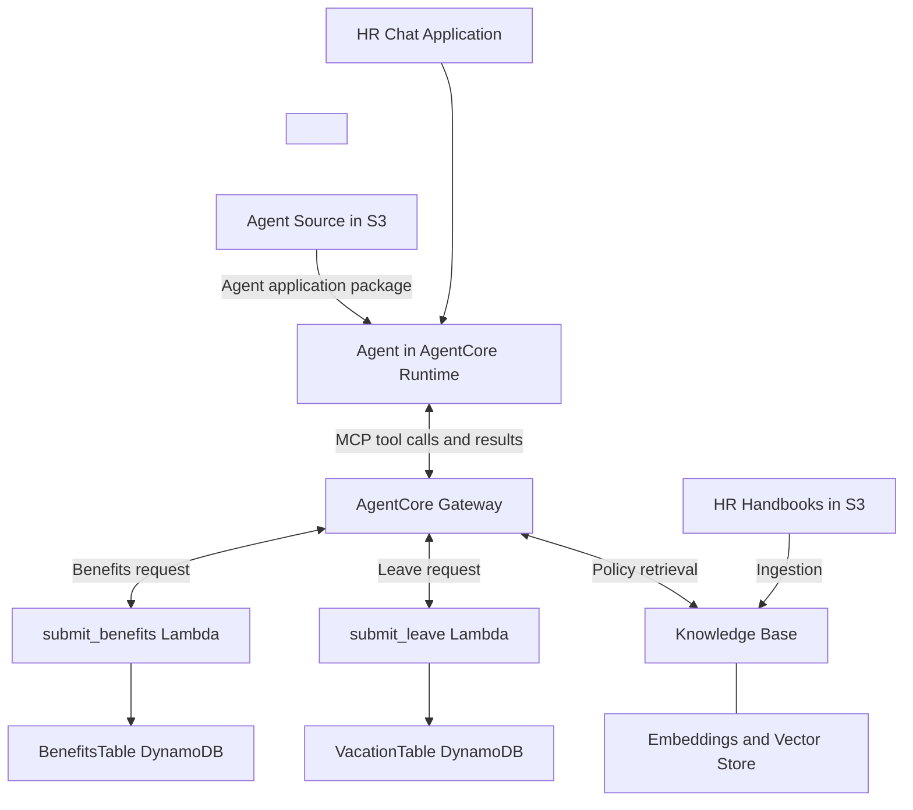
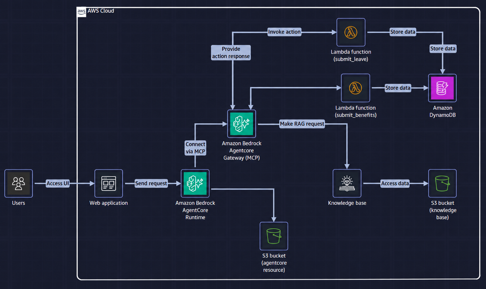
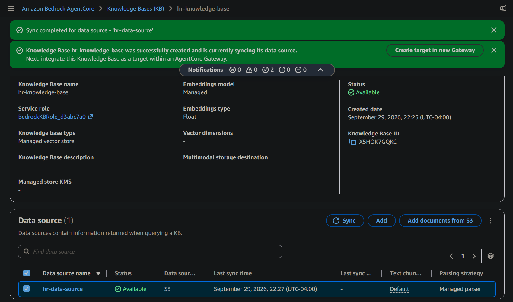
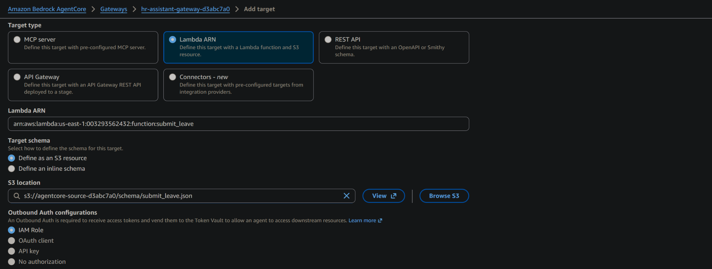
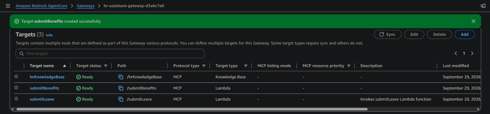
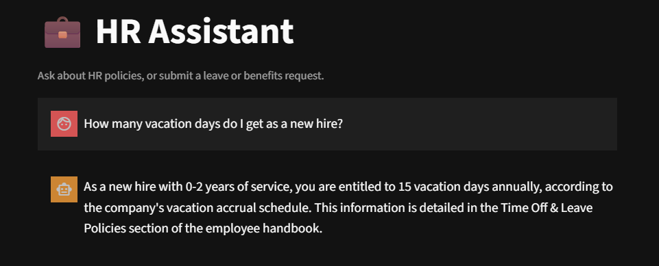
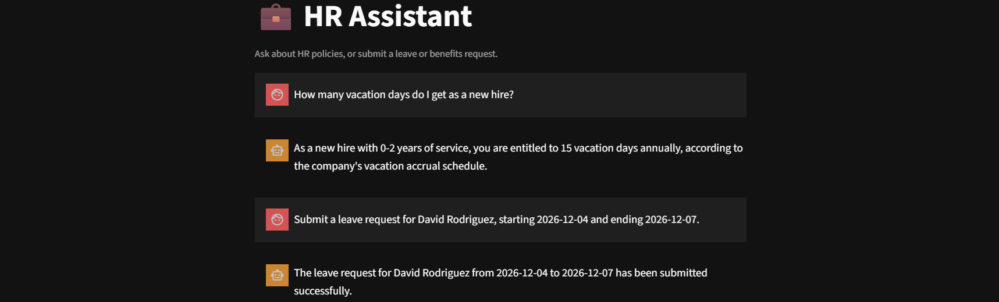
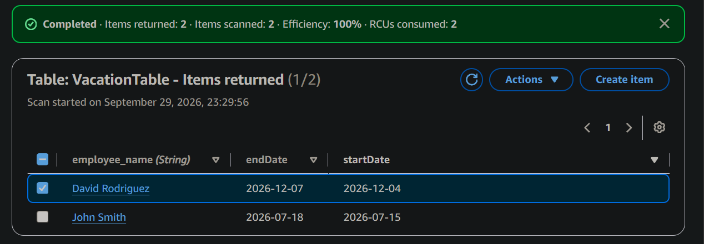
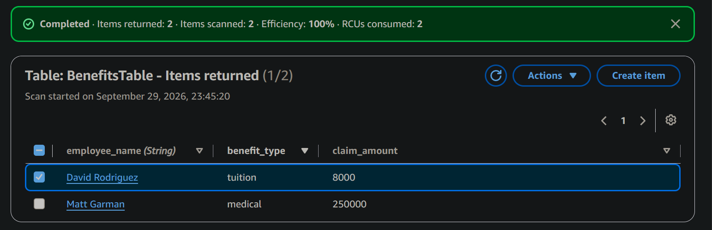

# AI HR Assistant: Agentic AI Solution on AWS

## Overview

The scenario described an HR department handling more than 500 daily employee requests, often repeating information already available in its handbooks. The proposed assistant would make that information accessible through a chat interface and provide tools for submitting leave and benefits requests. This was the business requirement, not a load or availability result measured in the lab.

An HR assistant needs to do two different kinds of work: answer questions from company policies and carry out requests that change application state. In this AWS re/Start lab, I connected both capabilities through **Amazon Bedrock Knowledge Bases** and **Amazon Bedrock AgentCore Gateway**.

I created and synchronized an S3-backed managed knowledge base, exposed it through the provided MCP gateway, and added two Lambda targets: `submitLeave` and `submitBenefits`. I then tested policy questions and action requests through the supplied HR application, independently verifying the submitted data in DynamoDB.

Beyond completing the workflow, **I explored the underlying engineering responsibilities AWS packages into these managed services.**

### Key Concepts

- **Agentic AI:** AI systems that can act independently on their own to achieve a goal
- **Amazon Bedrock:** Provides access to foundation models and capabilities for building generative AI applications.
- **Amazon Bedrock AgentCore Runtime:** Hosts and runs the agent application.
- **Amazon Bedrock AgentCore Gateway:** Exposes backend capabilities as tools through an MCP interface.
- **Knowledge Base:** Ingests source documents and retrieves relevant content for the agent.
- **Managed-service abstractions:** Package underlying engineering responsibilities into services the engineer configures and integrates.
- **Retrieval-Augmented Generation (RAG):** Supplies retrieved source content as context for generating an answer.
- **Model Context Protocol (MCP):** Standardizes how agents discover and call tools.


### Lab Environment

AWS re/Start supplied the training environment: HR handbook documents, application and agent, AgentCore Runtime and Gateway, IAM roles, Lambda functions, DynamoDB tables, tool-schema resources, and underlying hosting infrastructure.

My work focused on creating and synchronizing the knowledge base, connecting the knowledge-base and Lambda targets to the gateway, correcting a target resource reference, testing the application, and comparing its responses with persisted database records in DynamoDB.



The diagram shows the configured service relationships. The agent chooses tools for a request; it does not need to invoke every backend on every turn.

<details>
<summary>View lab components and architecture diagram</summary>

| Component | Role in the system |
| --- | --- |
| HR chat web application | Accepts natural-language questions and requests; displays responses |
| AgentCore Runtime | Hosts the supplied agent application |
| Agent-resource S3 bucket | Stores supplied agent resources, including Lambda tool schemas |
| AgentCore Gateway | Exposes retrieval and action tools through an MCP endpoint |
| Knowledge base | Ingests handbook content and provides retrieval |
| Knowledge-source S3 bucket | Stores the original HR documents |
| Lambda functions | Execute the supplied leave and benefits submission logic |
| DynamoDB | Persists the resulting operational records |



</details>

## Creating and Synchronizing the Knowledge Base

I created `hr-knowledge-base` with the HR handbooks in S3 as its data source, synchronizing the source to make its content available for retrieval.

The resulting configuration showed:

- **Knowledge base type:** Managed vector store
- **Embedding model:** Managed
- **Data source:** `hr-data-source`, using S3
- **Parsing strategy:** Managed parser
- **Text chunking:** Default
- **Result:** Sync completed; knowledge base and data source available



I used the service-managed embedding and storage configuration rather than provisioning a separate vector database or selecting a named embedding model. The completed sync established ingestion readiness; answering a question through the application tested the next part of the system.

## Connecting Retrieval and Action Tools Through MCP

I added the knowledge base to the pre-provisioned HR gateway as the `hrKnowledgeBase` target. This exposed handbook retrieval to the agent through the gateway's MCP interface.

I then added Lambda targets for the supplied `submit_leave` and `submit_benefits` functions. Each target referenced the actual function ARN and a tool-schema file in the agent-resource S3 bucket:

```text
schema/submit_leave.json
schema/submit_benefits.json
```



### ARN, Schema, and Permissions

These configurations represent three different requirements:

| Requirement | What it answers |
| --- | --- |
| Resource ARN | Which AWS resource should be called? |
| Tool schema | What does the tool do, and what arguments does it accept? |
| IAM permissions | Is the calling identity allowed to perform that action on that resource? |

An ARN identifies a resource; it is not responsible for authenticatation or granting access. The schema provides the tool's contract, including its name, input properties, and required fields. The agent uses that definition to construct a tool call, while Gateway routes the arguments to Lambda. IAM establishes the caller's identity and determines whether that identity is authorized to perform the required actions on the relevant resources.

### Correcting the Lambda Resource Reference

While adding a Lambda target, I initially encountered an invocation-permission error with an example ARN still in the function field. That ARN identified a placeholder rather than the lab function. I replaced it with the actual lab Lambda ARN and completed the target configuration.

The useful troubleshooting lesson was to verify **which resource an error refers to** before changing IAM permissions. An authorization error can involve an incorrect resource reference as well as an incorrect policy.

After both action targets were added, the gateway showed all three targets as `Ready`:



Gateway readiness verified configuration state. I tested actual behavior separately through the application.

## Policy-Question Test

I asked:

> How many vacation days do I get as a new hire?

The assistant answered that employees with 0-2 years of service receive **15 vacation days annually**, identifying the employee handbook's Time Off & Leave Policies section as the source.



This demonstrated the application returning a policy answer that referenced the configured handbook content. The screenshot shows the answer and named source, but does not independently verify which passages were retrieved.

## End-to-End Action Verification

### Leave Submission

I submitted the following request through the chat application prompting the assistant to return a submission confirmation:

> Submit a leave request for David Rodriguez, starting 2026-12-04 and ending 2026-12-07.



I then inspected `VacationTable` in DynamoDB and found the matching employee and dates (as well as the older one I submitted for 'John Smith'):



The matching record provided evidence beyond the assistant's success message: the values submitted through chat were persisted in the backend table.

### Benefits Submission

I also tested a tuition claim, extending the supplied medical-benefit example with a different benefit type:

> Submit a benefits claim for Matt Garman, medical, for $250000.  
> Submit a benefits claim for David Rodriguez, tuition, for $8000.


I inspected `BenefitsTable` and verified the same values:



This showed that the submission path accepted and stored both values. It did not establish a tuition-reimbursement policy, eligibility decision, approval workflow, or payment capability.

### What the Tests Established

A completed sync confirmed handbook ingestion, and three Gateway targets marked `Ready` confirmed tool configuration. The assistant answered a policy question by referencing a handbook section. Leave and benefits requests received chat confirmations and produced matching DynamoDB records, verifying request processing and persistent storage.

For the action tests, the strongest evidence was **request → application confirmation → matching backend state**. A lab validation result can confirm completion, but the database records directly support the demonstrated application behavior.

---

# What the Managed Services Abstract

### Understanding the RAG Pipeline

I conceptually separated RAG into **ingestion/indexing** and **query/retrieval**. Preparing searchable knowledge and answering a question are different workflows.

### Ingestion and Indexing

My underlying model became:

```text
source documents
→ extract and prepare usable text
→ split text into chunks
→ send chunks to an embedding model
→ receive vectors
→ index vectors with their text and source metadata
```

Text extraction and chunking can be performed by deterministic code. That code prepares and sends the text; the embedding model creates its numerical representation.

The practical intuition I developed was that embeddings turn aspects of language meaning into numbers (vectors) that can be compared mathematically. The stored vector remains associated with its human-readable chunk and source metadata. That relationship makes search results useful to the language model and traceable to the document.

### Query and Retrieval

This is the conceptual vector-search model I worked through, not a measured trace of the lab's managed retrieval internals. Managed retrieval can also combine semantic and keyword search and apply additional ranking.

The foundational vector-retrieval model became:

```text
query text / user question
→ embedding model
→ query vector
→ vector store and vector search
→ matching chunks and source metadata
→ context supplied to the language model
→ answer
```

Vector search is a capability of the vector store or search system. Retrieval can return multiple relevant chunks, rather than only the single nearest match. The language model uses the retrieved text as context, not the stored vector itself.

### Keeping Indexed Knowledge Current

I connected document freshness to an event-driven pattern I already understood:

**Source changes → detect change → run ingestion → update indexed state**

In a custom system, that could mean retrieving a changed document, extracting and chunking its text, generating new embeddings, and updating or removing the corresponding indexed content.

In this lab, I synchronized the S3 source through the managed service. I did not implement or test an automatic S3 change-event pipeline. A document update still needs a synchronization mechanism; storing a new source version is not evidence that the searchable index has already been refreshed.

### Managed RAG

A custom RAG implementation requires coordination across document preparation, embedding calls, indexing, retrieval, and context assembly. Frameworks and existing databases can supply parts of that implementation; the engineer does not need to invent each component from scratch.

| Responsibility | How it was handled here |
| --- | --- |
| Parsing and chunking | Managed parser and default chunking |
| Embedding generation | Service-managed embedding model |
| Vector storage and indexing | Managed vector store |
| Retrieval | Managed knowledge-base capability exposed as a tool |
| Source refresh | Managed ingestion invoked through synchronization |
| Answer generation | Supplied agent/application using the retrieval capability |

Managed services handle much of document preparation, embedding generation, indexing, and retrieval, while source suitability, freshness, and answer quality remain system concerns.

### Managed MCP Tool Access

Without the managed Gateway integration, an engineer could build or host an MCP server or adapter that exposes the tool catalog, accepts calls, connects to the appropriate backend, and returns usable results.

Gateway supplied the MCP endpoint, discovery interface, target routing, and configured access mechanisms. I supplied target references and selected the provided schemas. The agent retained responsibility for deciding which tool to request, while Lambda retained business-related request processing.

**RAG and MCP solve different problems.** RAG supplies relevant knowledge for generation. MCP standardizes access to tools. This assistant used an MCP tool for retrieval alongside tools that wrote operational records.

## Takeaways

- **Managed services package engineering responsibilities.** Using the abstraction became more meaningful once I understood the processing and integration work beneath it.
- **Retrieval and actions are different capabilities.** The assistant could answer policy questions and submit data through separate tools behind the same gateway.
- **RAG has two separate flows.** Ingestion prepares and indexes knowledge; retrieval finds context for a question.
- **Embeddings support retrieval, while text supports the answer.** A vector is useful because it remains associated with the original content and its source.
- **Resource identity, access, and tool contracts are distinct.** The ARN identifies the backend, IAM controls access, and the schema describes the call.
- **Verification should reach the system's state.** Matching DynamoDB records supplied stronger action evidence than a chat success message alone.
