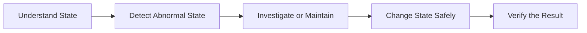

# Cloud Operations Engineering

## About

Engineers deploying cloud infrastructure need more than successful provisioning. Running systems requires both the ability to **observe what is happening** and the ability to **change, maintain, secure, and verify system state** for reliable operation.

These labs develop hands-on Cloud Operations Engineering capability across centralized systems management, fleet maintenance, observability, alerting, configuration compliance, audit investigation, operational security, and verified remediation on AWS.

## Labs

### [01 — Systems Hardening with Patch Manager](systems-hardening-patch-manager.md)

Applied patch policy across Linux and Windows EC2 fleets using managed and custom patch baselines, patch groups, tag-based targeting, and compliance reporting.

An unexpected Windows compliance result became a troubleshooting exercise in distinguishing successful maintenance execution from verified compliant system state.

### [02 — Using AWS Systems Manager](using-systems-manager.md)

Used Inventory, Run Command, Parameter Store, and Session Manager to centrally inspect, configure, operate, and access a managed EC2 instance without relying on direct server-by-server administration.

### [03 — Monitoring Infrastructure](monitoring-infrastructure.md)

Built an operational monitoring layer around an EC2 web server using CloudWatch Agent, CloudWatch Logs, metric filters, alarms, EventBridge, SNS, and AWS Config.

Collected host metrics and application logs, detected runtime errors and infrastructure state changes, generated notifications, and evaluated configuration compliance.

## Cloud Operations Model

The four labs cover two complementary layers of operating cloud systems.

### Feedback Layer

**Monitoring Infrastructure** provides visibility into what systems are doing, what changed, whether behavior has deviated from expectations, and why.

They develop:

- observability
- detection and alerting
- investigation and compliance awareness

### Control Layer

**Using AWS Systems Manager** and **Systems Hardening with Patch Manager** provide the mechanisms for centrally administering, changing, maintaining, and verifying running systems.

They develop:

- centralized management
- controlled execution and access
- maintenance and verification

**Both layers demonstrate a foundational Cloud Operations Engineering capability:**

