# CloudTrail Investigation & Change Detection

## Overview

This lab investigated a cloud security incident using AWS logs. I contained the compromise in AWS and on the EC2 instance, then added alerts for future changes.

The Café website ran on a compromised EC2 instance. An unauthorized security-group rule exposed SSH to `0.0.0.0/0`. I used AWS CloudTrail, the AWS CLI, and Amazon Athena to find who made the change and which API they used. I removed the open access and secured the instance.

**I also extended the lab**, creating an EventBridge detection rule that monitors security-group changes and sends human-readable SNS email alerts.

### Key Concepts

- **AWS CloudTrail** — Records AWS API activity for audit and investigation.
- **Amazon Athena** — Queries CloudTrail logs stored in S3 using SQL.
- **Amazon EventBridge** — Detects matching AWS API events and routes them for action.
- **Incident containment** — Removing compromised access paths across AWS, network, host, and IAM layers.

### Lab Environment

AWS re/Start provided a pre-provisioned EC2 instance already set up with the Café website, its VPC, security group, IAM identities, and lab automation.

My work focused on investigating the unauthorized security-group change, containing the compromise, and adding EventBridge and SNS detection for future changes.

## Identifying the Security-Group Exposure

The Café web server security group had an unauthorized inbound rule that allowed SSH access from anywhere:

```text
TCP 22 → 0.0.0.0/0
```

The separate SSH rule allowing access from one `/32` address and was the expected admin path that I configured.

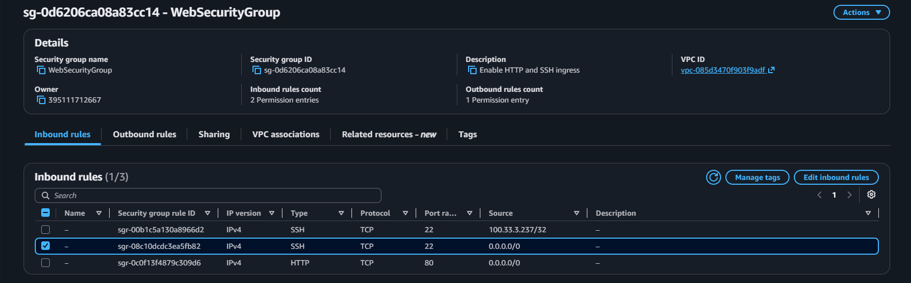

This rule was the main clue: I needed to find **who changed the security group, when the change occurred, and how it was performed**.

## Investigating the Change with CloudTrail

CloudTrail provided the audit record for the security-group change. I used CloudTrail lookup commands to find activity linked to the Café web server security group, then queried the trail's S3-backed logs with Amazon Athena for structured analysis.

Athena identified the `chaos` user performing `AuthorizeSecurityGroupIngress`. The event included the source IP and the request details associated with the security-group modification, including the rule that opened SSH access.

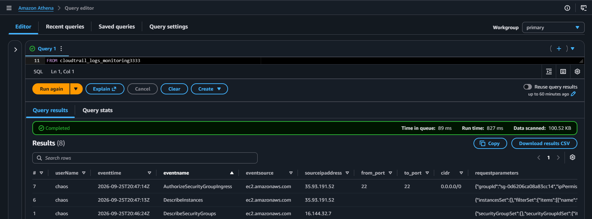

The investigation linked the current security-group state to the API action that created it:

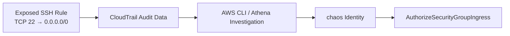
Operational distinction: CloudTrail did not simply show the current security group misconfiguration. It preserved evidence of the **API action and identity responsible for creating it**.

## Containing and Remediating the Incident

### Removing the Network Exposure

After identifying the unauthorized change, I revoked the malicious SSH ingress rule from the web server security group.

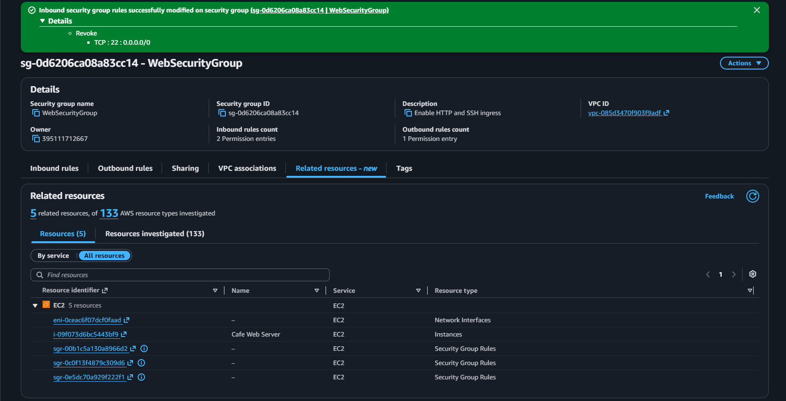

This removed the immediate network exposure, but the investigation continued because changing the security group alone did not guarantee that the compromised host or credentials were clean.

### Removing the Unauthorized Host Session

Authentication logs on the EC2 instance showed activity from an unexpected `chaos-user`.

The account could not initially be deleted because the user still had an active process. I identified the active session, terminated the process, verified that the unauthorized user was no longer connected, and then removed the account.

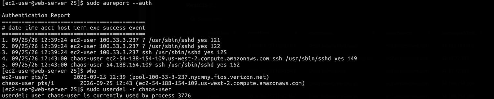
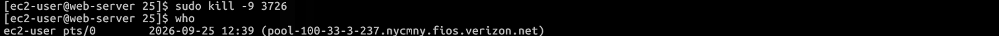

This reinforced why removing an account is not sufficient, containment must include removing active sessions or processes if they still exist, not only account deletion.

### Hardening SSH Authentication

Inspection of `/etc/ssh/sshd_config` showed that password authentication had been enabled. I changed the configuration so that SSH password authentication was disabled, restoring key-based authentication as the expected access mechanism.

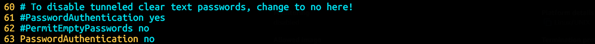

### Removing the Compromised AWS Identity

The `chaos` IAM identity was also used for AWS API activity. I deactivated its access and removed the user from the AWS account.

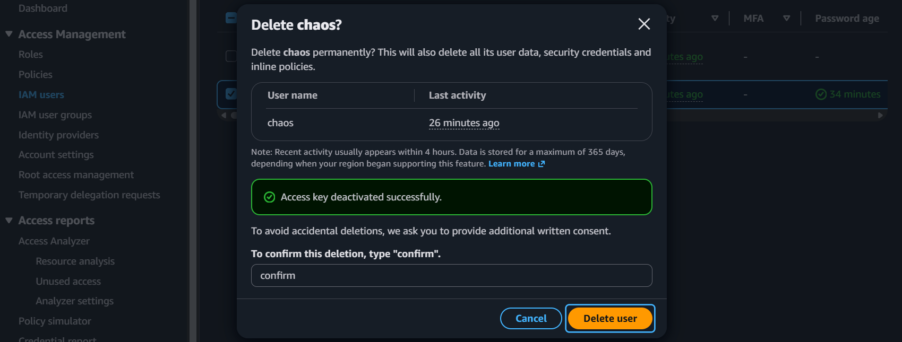

The remediation therefore addressed multiple layers of access:

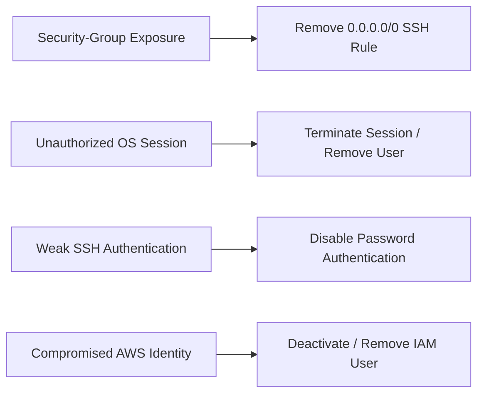

## Extension — Proactive Security-Group Change Detection

The original investigation was retrospective. I extended the observability by adding alerts so that future security-group rule mutations could generate an operational alert as they occur.

### Implementation Adaptation

The initial plan was to send CloudTrail logs to CloudWatch Logs followed by a metric filter and alarm. The training sandbox did not permit creating or passing the IAM role required for that setup.

I implemented the same operational objective with EventBridge by matching CloudTrail-recorded EC2 API activity directly and routing matching events to SNS.

The resulting architecture was:

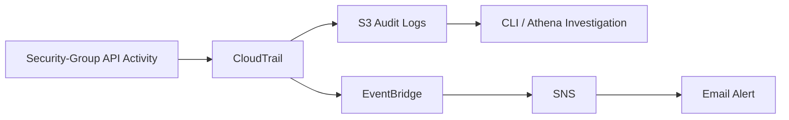

This enables **retrospective audit and investigation** through S3, CLI, and Athena, and **real-time change detection** through EventBridge and SNS.

### Detecting Security-Group Mutations

I broadened the rule to monitor the primary APIs that change security-group traffic rules rather then only detecting the exact API call from the incident:

```json
"eventName": ["AuthorizeSecurityGroupIngress", "RevokeSecurityGroupIngress", "AuthorizeSecurityGroupEgress", "RevokeSecurityGroupEgress", "ModifySecurityGroupRules"]
```

More useful than matching a single-incident signature, the EventBridge pattern filtered for EC2 API calls delivered through CloudTrail and matched those mutation events. The rule detects both additions and removals across ingress and egress rules, as well as direct rule modifications.

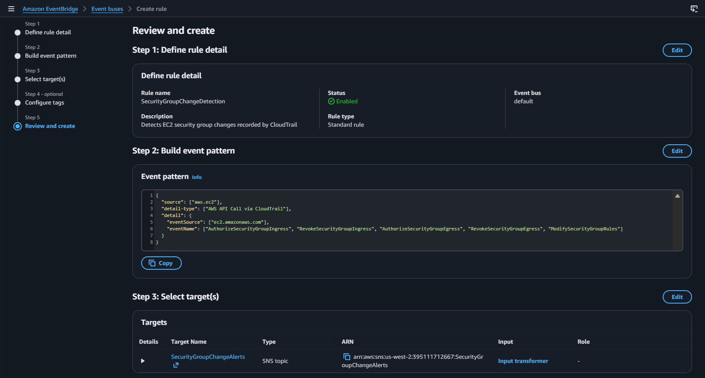

### Controlled Validation

To test the detection path, I created a temporary ingress rule on TCP port `2222` restricted to the documentation-only address `203.0.113.1/32`, then revoked it.

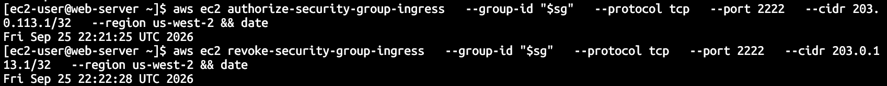

The validation generated two different AWS API events: `AuthorizeSecurityGroupIngress` and `RevokeSecurityGroupIngress`. Both events matched the EventBridge rule and were routed to the `SecurityGroupChangeAlerts` SNS topic.

### Human-Readable Operational Alerts

An EventBridge input transformer extracted the fields most useful during initial triage rather than sending the full raw CloudTrail event.

Both the authorize and revoke tests generated successful email notifications, including:

- action performed
- affected security group
- protocol
- port range
- CIDR
- actor
- source IP
- Region
- event time

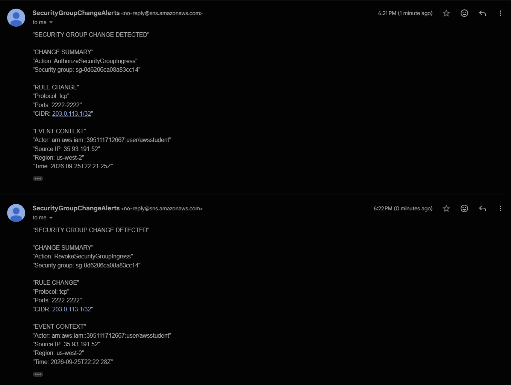

The completed proactive workflow was:

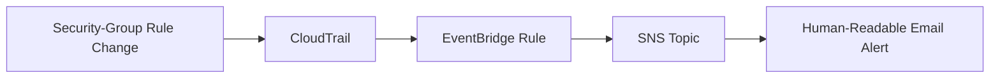

## Incident Response Process

The complete lab demonstrated a broader Cloud Operations incident lifecycle:

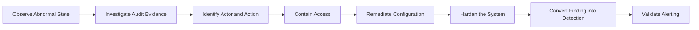

The most valuable progression was from **finding a bad configuration** to understanding **how it was created**, correcting the resulting access paths, and then turning the discovered behavior into a reusable detection control.

## Takeaways

- **Incident containment must cover every access layer.** Removing the security-group exposure was only one part of the response; the active OS session, SSH authentication configuration, and compromised IAM identity also required remediation.
