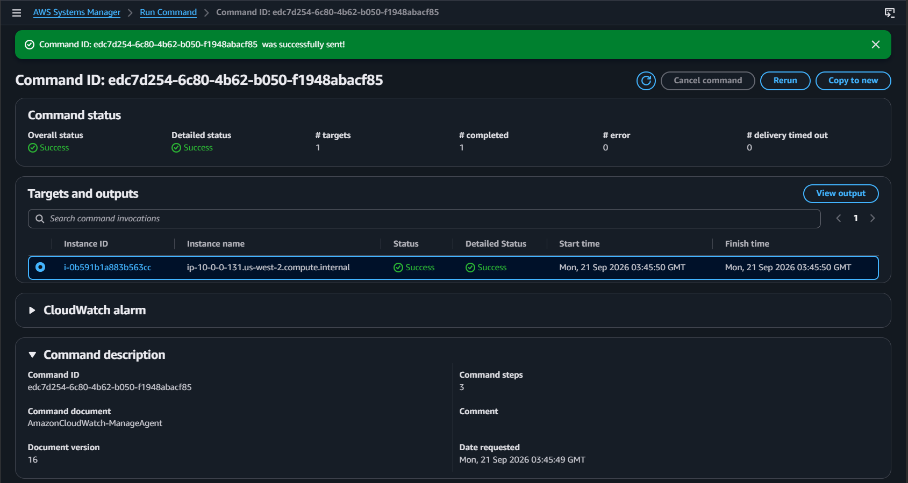
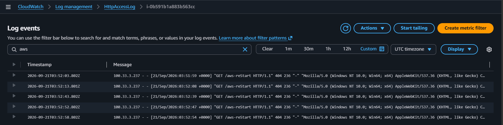
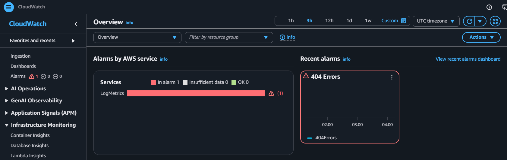
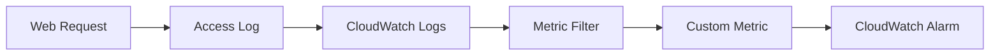
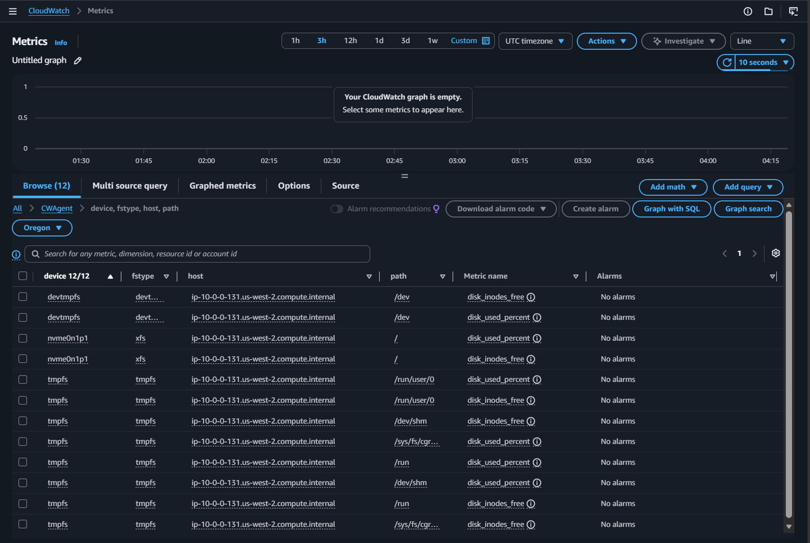
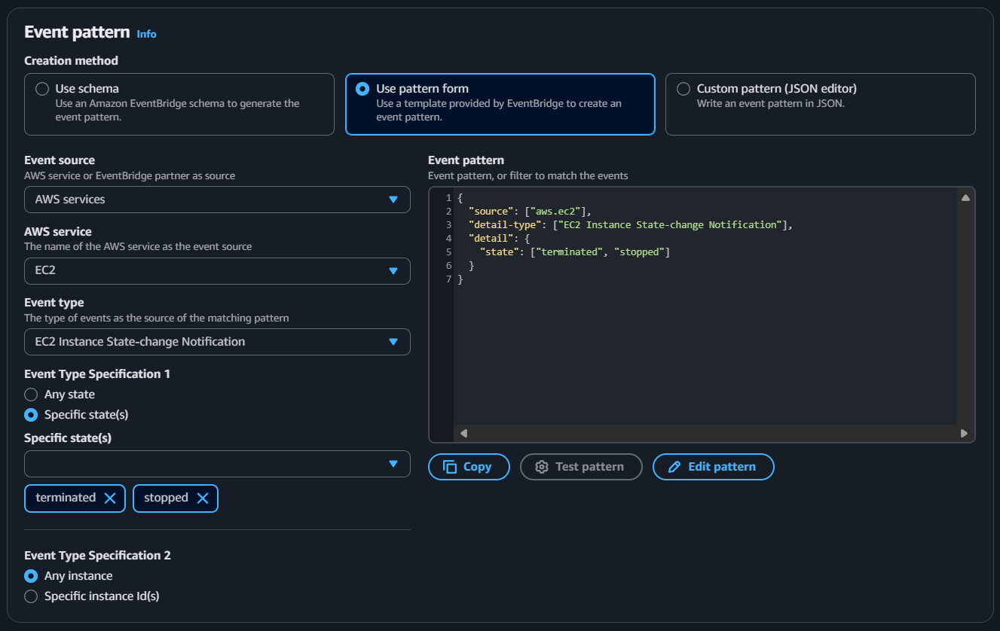
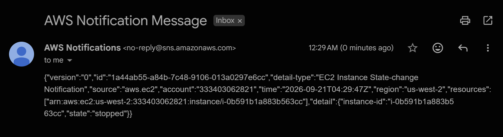
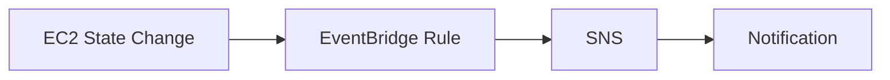
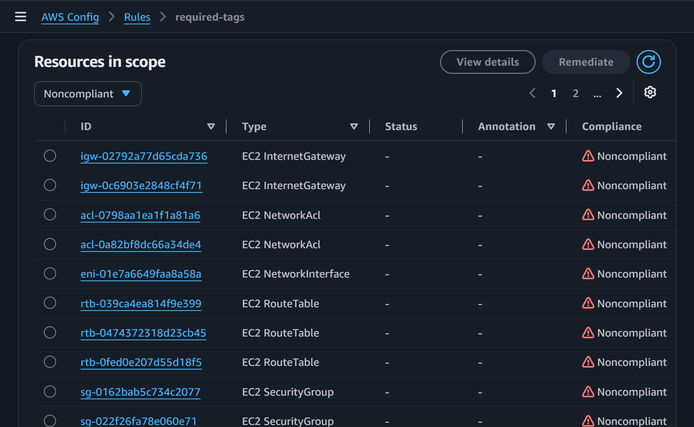
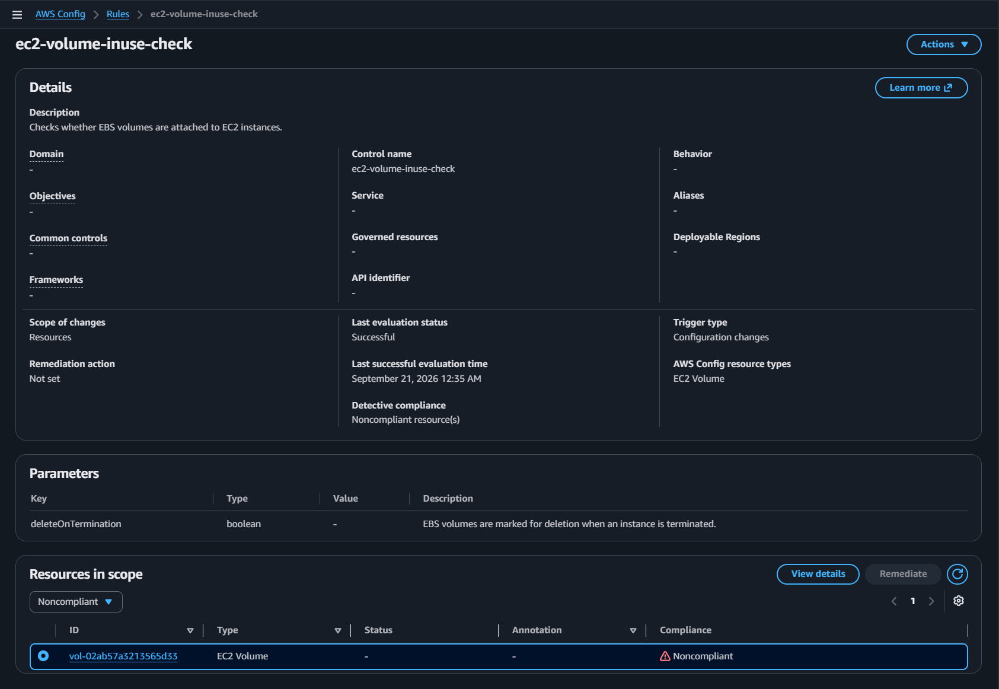

# Monitoring Infrastructure

## Overview

When operating cloud infrastructure, engineers require also need visibility into system behavior, application activity, infrastructure changes, and configuration state rather than just keeping resources available. This enables swift detection and investigation of abnormal conditions.

I used Amazon CloudWatch, AWS Systems Manager, Amazon EventBridge, Amazon SNS, and AWS Config to collect telemetry from an EC2 web server, centralize application logs, detect error conditions, monitor infrastructure changes, and evaluate resource compliance.

### Key Concepts

- **CloudWatch Agent** — Software running on the EC2 instance that collects host-level metrics and log files and sends them to CloudWatch.
- **CloudWatch Logs** — Centralizes application and system logs so they can be reviewed and monitored without directly accessing the instance.
- **Amazon EventBridge** — Detects discrete AWS infrastructure events and routes matching events to another service.
- **Amazon SNS** — Delivers notifications when monitored conditions or infrastructure events occur.
- **AWS Config** — Evaluates resource configuration against defined rules and reports compliant or noncompliant state.

### Lab Environment

AWS re/Start provided an EC2 web server and the supporting IAM permissions required for the monitoring workflow.

The infrastructure was already provisioned. My work focused on configuring the monitoring, alerting, and compliance layers around the running system.

## Configuring Host Monitoring with the CloudWatch Agent

I used AWS Systems Manager Run Command to configure and start the CloudWatch Agent on the web server.

The agent configuration was stored in Systems Manager Parameter Store and defined both the web server log files and the operating-system metrics that should be collected. The completed Run Command confirmed that the agent was successfully configured against the managed instance.



This established the telemetry pipeline between the running EC2 instance and CloudWatch without requiring manual configuration through an interactive server session.

## Centralized Application Logging

After the agent was running, the web server's access and error logs were shipped into CloudWatch Logs.

I generated a request for a nonexistent `/start` path and verified that the resulting HTTP `404` response appeared in the centralized access-log stream.



This demonstrated how application logs can be collected centrally and reviewed without connecting directly to the instance.

## Detecting Application Errors with Logs and Alarms

I created a CloudWatch Logs metric filter that matched access-log entries with HTTP status code `404`.

Each matching event incremented a custom metric. I then created a CloudWatch alarm that evaluated the metric and entered the `ALARM` state after the number of errors crossed the configured threshold.



The workflow connected application behavior to an operational signal:



Instead of requiring an operator to inspect logs manually, the monitoring system could detect the condition automatically.

## Monitoring Operating-System Metrics

I reviewed metrics collected by the CloudWatch Agent from inside the EC2 instance.

The `CWAgent` namespace exposed operating-system telemetry such as disk utilization and filesystem information that is not available from the standard EC2 service metrics alone.



This reinforced the distinction between platform-level metrics provided automatically by AWS and deeper host-level metrics collected from inside the instance.

## Detecting Infrastructure State Changes

I created an EventBridge rule that matched EC2 instance state-change events when an instance entered the `stopped` or `terminated` state.



The rule routed matching events to an SNS topic. After stopping the web server, I received an SNS notification containing the EC2 state-change event.





Unlike metric-based monitoring, this workflow reacts directly to a discrete infrastructure event.

## Monitoring Configuration Compliance

I used AWS Config managed rules to evaluate whether resources matched defined configuration requirements.

The `required-tags` rule identified resources that did not contain the required `project` tag.



I also reviewed the `ec2-volume-inuse-check` rule, which identified an EBS volume that was not attached to an EC2 instance.



CloudWatch monitoring primarily answers questions about **what a system is doing**, while AWS Config evaluates whether **the system's configuration matches an expected policy state**. They provide two different forms of operational visibility: runtime behavior and configuration compliance.

## Operational Model

The lab demonstrated a broader monitoring workflow for running cloud systems:

1. **Instrument** — Configure the CloudWatch Agent to collect logs and host metrics.
2. **Observe** — Centralize telemetry in CloudWatch for system and application visibility.
3. **Detect** — Convert meaningful log patterns and infrastructure events into operational signals.
4. **Notify** — Route detected conditions through alarms and SNS.
5. **Evaluate** — Use AWS Config to compare resource configuration against expected policy.

```text
Running Cloud System
        │
        ▼
Collect telemetry
logs / host metrics
        │
        ▼
Observe system behavior
        │
        ├───────────────┐
        ▼               ▼
Detect runtime      Detect infrastructure
conditions          state changes
        │               │
        ▼               ▼
CloudWatch alarm    EventBridge
        │               │
        └───────┬───────┘
                ▼
             Notify
                │
                ▼
Evaluate configuration
with AWS Config
```

## Takeaways

- **Centralized telemetry reduces server-by-server operations.** CloudWatch made logs and system metrics available without requiring direct access to the instance.
- **Event-driven monitoring complements metric monitoring.** EventBridge detected discrete infrastructure changes that did not depend on a thresholded performance metric.
- **Compliance is a form of operational visibility.** AWS Config evaluated whether resources matched expected configuration rules rather than only reporting runtime behavior.
- **The operational goal is actionable visibility.** Useful monitoring should make abnormal state easier to detect, communicate, and investigate.
