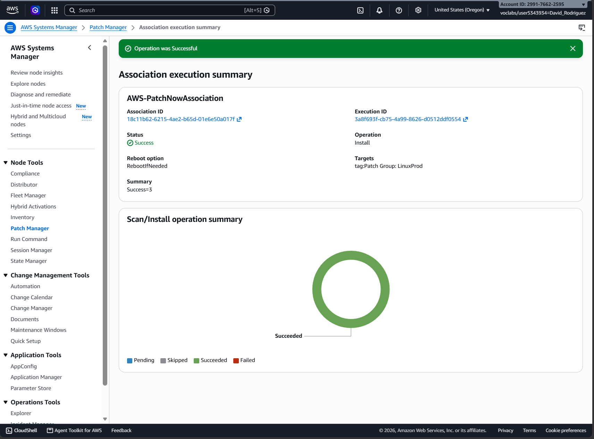
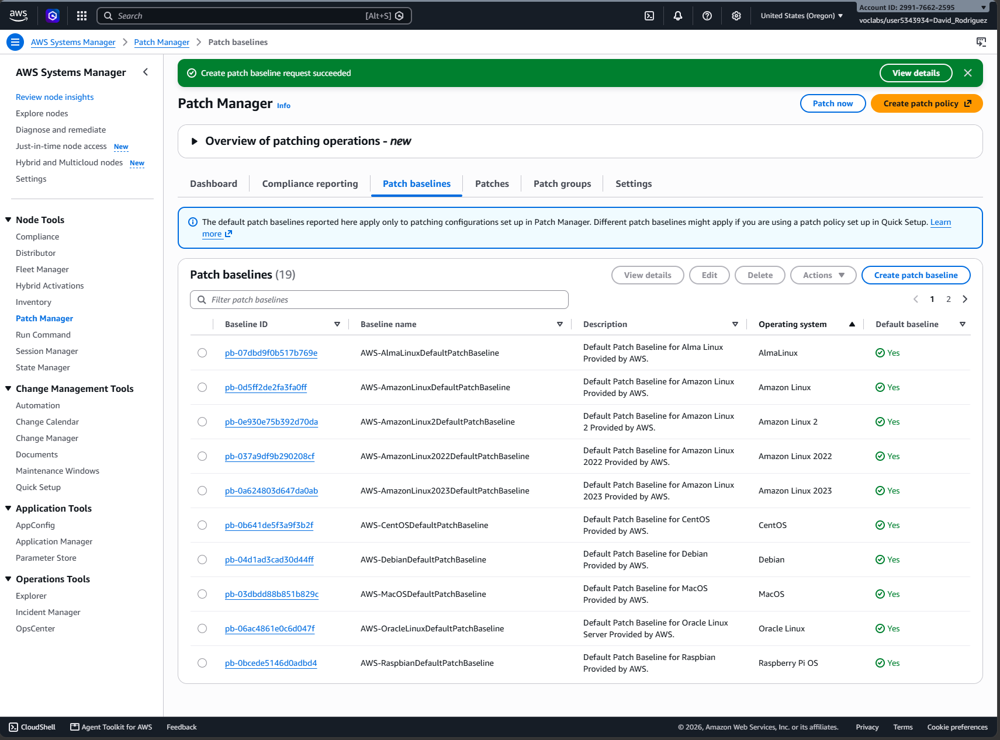
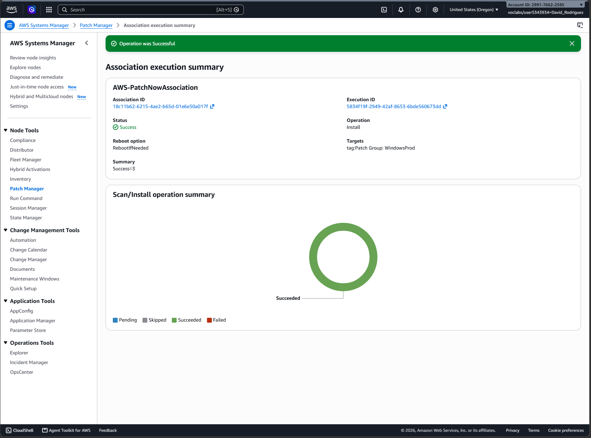
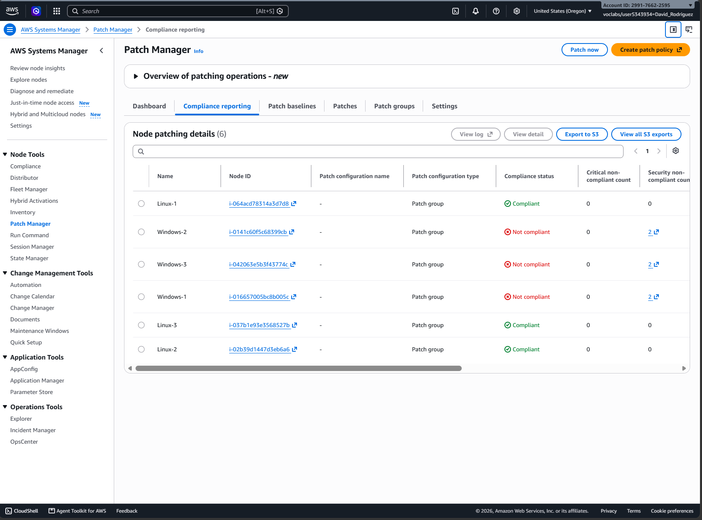
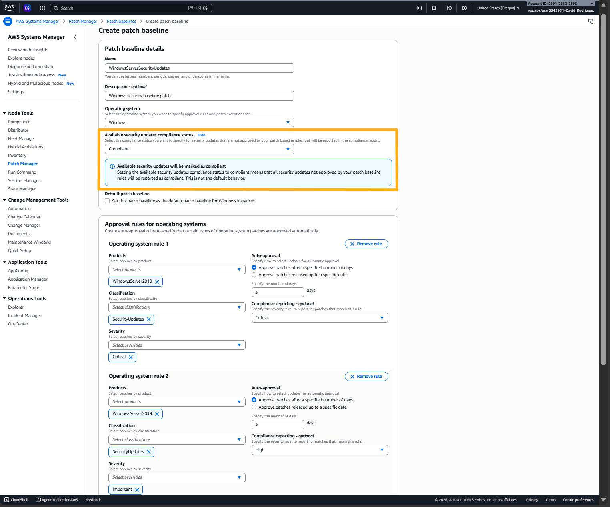
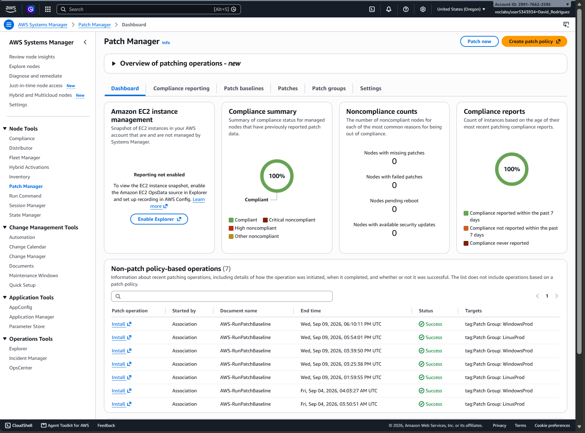

# Systems Hardening with Patch Manager

## Overview

Patching individual servers manually becomes difficult to manage as an environment grows. Organizations need a consistent way to define patch policy, apply it across groups of systems, execute maintenance centrally, and verify that systems actually meet the intended patch state.

In this AWS re/Start lab, I used AWS Systems Manager Patch Manager to manage patching across Linux and Windows EC2 fleets. An unexpected Windows compliance result also became a troubleshooting exercise in separating patch execution from compliance evaluation.

## Key Concepts

- **AWS Systems Manager** — Centralized management service for operating and maintaining managed compute resources.
- **Patch Manager** — Systems Manager capability for defining patch policy, applying patches across managed nodes, and tracking patch compliance.
- **Patch baseline** — Defines which patches are approved and when they become eligible for installation.
- **Patch group** — Uses tags to group managed instances under the same patch baseline.
- **Compliance** — Reports whether a managed instance's patch state satisfies the baseline and its compliance rules.

## Lab Environment

AWS re/Start provided:

- 3 Amazon Linux EC2 instances
- 3 Windows Server EC2 instances
- Required IAM roles and Systems Manager configuration

The infrastructure was already provisioned. My work focused on configuring and operating the patch-management workflow.

## Linux Fleet Patching

The Linux instances were grouped under `LinuxProd` and used the AWS-managed Amazon Linux patch baseline.

I ran a **Scan and install** operation against the patch group rather than maintaining each instance individually. All three Linux targets completed successfully.

This demonstrated the basic fleet-management model: systems can share a patch policy and be maintained together through Systems Manager.

## Windows Patch Policy

For the Windows fleet, I created a custom patch baseline named `WindowsServerSecurityUpdates`.

The baseline targeted Windows Server 2019 security updates with:

- Critical and Important severities
- `SecurityUpdates` classification
- 3-day automatic approval delay
- Critical and High compliance reporting severities

The original configuration also treated available security updates that were not yet approved by the baseline as noncompliant.

A **patch baseline** defines which updates are approved and when, while a **patch group** determines which systems receive that policy.

By tagging the three Windows instances, they were targeted through the `WindowsProd` patch group.

## Windows Fleet Patching

I ran a **Scan and install** operation against `WindowsProd`. All three Windows targets reported successful execution.

At this point, the patching operation itself had succeeded. I then checked Patch Manager compliance reporting to verify whether the resulting systems actually matched the expected policy state.

## Unexpected Compliance Result

Compliance reporting showed:

- all three Linux instances as compliant
- all three Windows instances as not compliant

This was an unexpected result because the Windows patch operation had completed successfully. That exposed the important distinction that **successful execution does not automatically mean compliant system state.** Execution answers whether the maintenance operation ran successfully. Compliance answers whether the resulting system state satisfies the policy used to evaluate it.

### AI-Assisted Diagnosis

I used an LLM as a diagnostic aid to investigate why the Windows patch operation could succeed while all three Windows nodes still reported noncompliance.

The investigation focused on the relationship between:

- the baseline's 3-day approval delay
- currently available Windows security updates
- the baseline's compliance treatment of updates that were available but not yet approved

The LLM identified a plausible explanation in the Windows-specific setting: `Available security updates compliance status`. In the original baseline, this was set to `Noncompliant`.

Because the baseline intentionally delayed approval for three days, a security update could exist without yet being eligible for installation. The hypothesis was that those available-but-not-yet-approved updates were being counted against compliance even though Patch Now had successfully handled the patches that were currently approved.

The lab instructions did not address this field in the current AWS console. Rather than treating the LLM's explanation as the answer, I ran the lab again to test the hypothesis.

## Testing the Hypothesis

I recreated the Windows baseline, preserving the intended patch policy but changing the relevant Windows-specific setting to `Available security updates compliance status = Compliant`.

This kept the approval policy intact while changing how updates still waiting for approval were interpreted by compliance reporting.

I then reran the Windows patch workflow and checked the resulting compliance state.

## Final Verification — Compliance

Patch Manager reported the managed fleet at **100% compliance**, with no nodes reporting missing patches, failed patches, pending reboots, or available-security-update noncompliance.

The rerun validated the troubleshooting hypothesis within the lab environment. Rather than an execution failure, the Windows noncompliance came from how the baseline evaluated security updates that were available but had not yet reached their approval window.

The troubleshooting process clarified the core components of patch-management:

1. **Policy** — Patch baseline defines what gets approved and when.
2. **Targeting** — Tags/patch groups determine which instances receive that policy.
3. **Execution** — Patch Manager / Systems Manager performs the patch operation.
4. **Compliance** — Reporting verifies whether the resulting state conforms to policy.

## Takeaways

- **Patch management is a policy-and-state problem.** The goal is to keep systems aligned with an expected patch state.
- **Patch groups make policy scalable.** Instead of assigning patch policy to machines individually, systems can be grouped by tags and managed under the same baseline as a fleet.
- **Execution and compliance are different.** A successful patch run does not necessarily mean the system is compliant.
- **The real goal is controlled, observable system state.** Define policy, apply it consistently, and verify the outcome.
