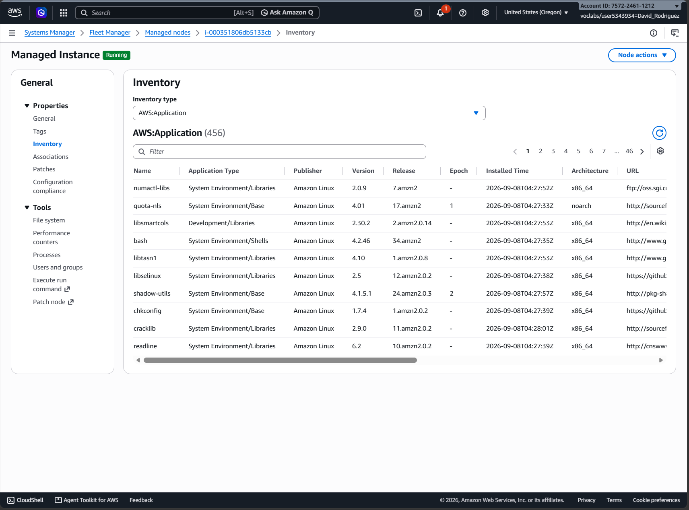
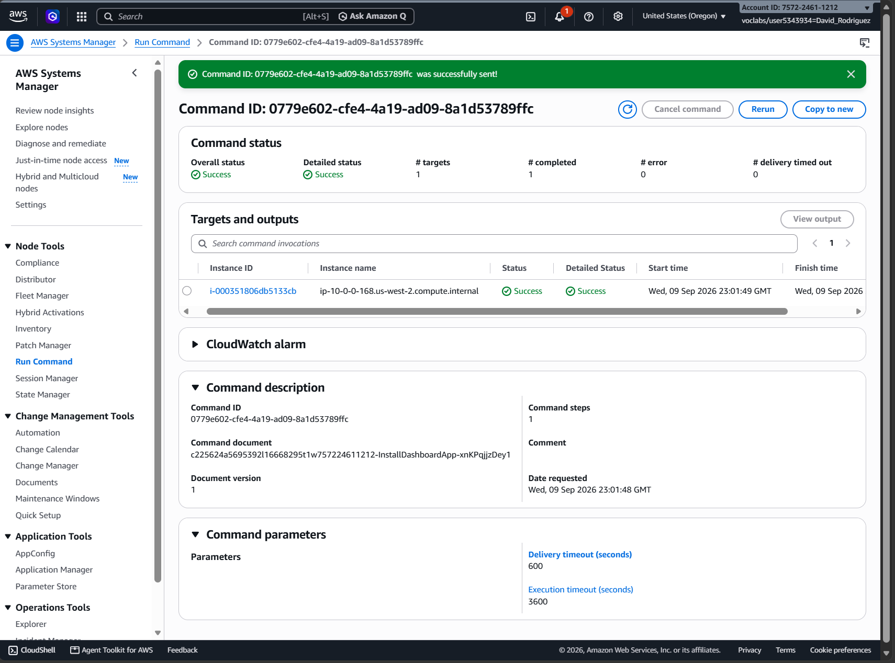
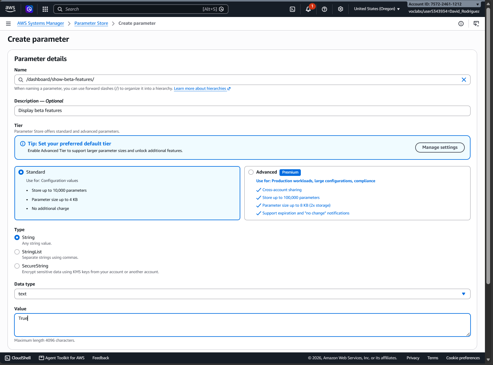
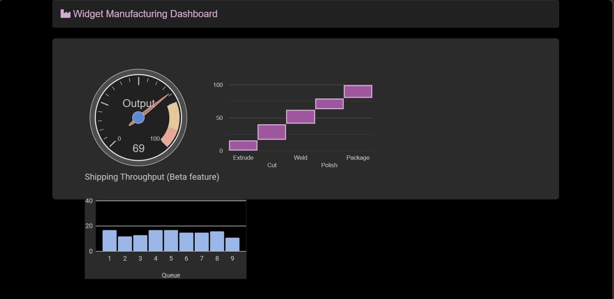
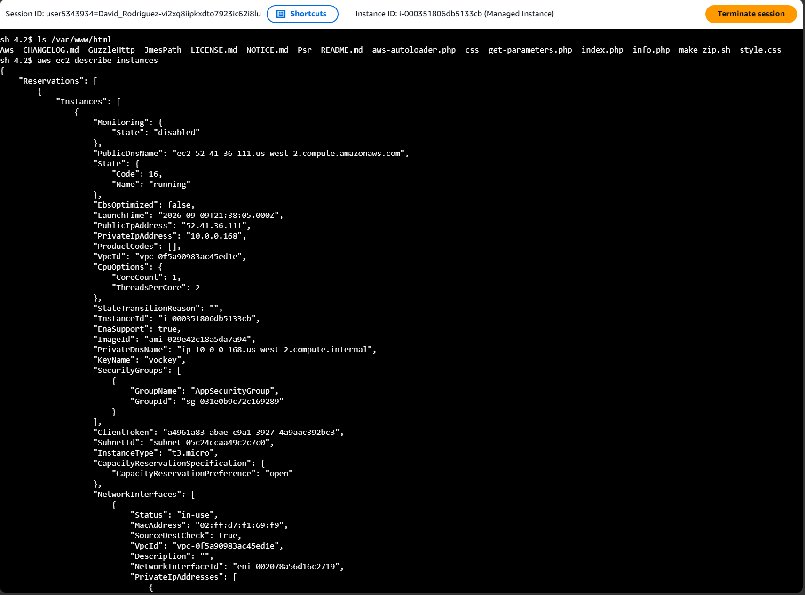

# Using AWS Systems Manager

## Overview

Managing cloud systems through individual server logins becomes inefficient as an environment grows. Operators need centralized ways to inspect systems, execute changes, manage configuration, and access instances when interactive administration is necessary.

In this AWS re/Start lab, I used AWS Systems Manager to centrally inspect, configure, operate, and access a managed EC2 instance through Inventory, Run Command, Parameter Store, and Session Manager.

## Key Concepts

- **AWS Systems Manager** — Centralized management service for operating and maintaining compute resources.
- **Managed node** — A compute resource registered with Systems Manager so it can be centrally managed.
- **Inventory** — Collects software and system metadata from managed nodes for centralized visibility.
- **Run Command** — Executes defined commands or Systems Manager documents on managed nodes without requiring interactive login.
- **Parameter Store** — Stores application configuration separately from the application that consumes it.
- **Session Manager** — Provides interactive access to managed nodes through Systems Manager rather than traditional SSH access.

## Lab Environment

AWS re/Start provided a managed EC2 instance with the SSM Agent, required IAM permissions, and supporting application resources.

The infrastructure was already provisioned. My work focused on using Systems Manager as the management layer for the running instance.

## Centralized Visibility with Inventory

I created a Systems Manager Inventory association for the managed instance and reviewed the software and system metadata collected from it.

This inventory provides centralized visibility into the instance's software state without requiring one to log directly into the machine.

## Remote Execution with Run Command

I used Systems Manager Run Command to install the Widget Manufacturing Dashboard on the EC2 instance.

The installation was executed through a Systems Manager document against the managed instance without requiring an interactive server session. The command completed successfully.

This demonstrated how a defined operational task can be executed remotely through the management layer rather than through direct server administration.

## Externalized Configuration with Parameter Store

I created the `/dashboard/show-beta-features` parameter in Parameter Store to enable the application's beta features.

After refreshing the dashboard, the application read the external configuration and exposed the additional **Shipping Throughput** feature.

This demonstrated how application configuration can exist outside the application itself and be changed independently of its code.

## Controlled Access with Session Manager

I opened an interactive shell on the EC2 instance through Session Manager. From the session, I verified the deployed application files with `ls /var/www/html` and used the AWS CLI to retrieve information about the running EC2 instance.

Session Manager provided interactive administrative access without exposing SSH, managing SSH keys, or relying on a bastion host, reducing the infrastructure and credential management required for secure instance access.

## Operational Model

The lab demonstrated four core functions of centralized systems management:

1. **Visibility** — Inventory provides information about managed system state.
2. **Execution** — Run Command performs defined operational actions remotely.
3. **Configuration** — Parameter Store keeps application settings separate from application code.
4. **Access** — Session Manager provides interactive administration when direct investigation is needed.

## Takeaways

- **Systems Manager centralizes systems operations.** Running compute can be inspected, configured, operated, and accessed through a common management layer.

- **Remote execution and interactive access solve different problems.** Run Command performs defined actions without a shell, while Session Manager provides interactive access when investigation is necessary.

- **Configuration can be managed independently from application code.** Parameter Store allowed an external value to change the behavior of the running application.

- **The real goal is scalable system administration.** Centralized management reduces the need to operate each server individually.
