# Launching an ECS Containerized Web Service

## Overview

A long-running application can be packaged into a container, but running that container reliably across cloud compute means managing both the application workload and the underlying compute capacity. In this lab, I used **Amazon Elastic Container Service (ECS)** with EC2-backed capacity to deploy an Apache HTTP Server container while keeping those two layers distinct.

I created an **ECS cluster** backed by an **EC2 Auto Scaling Group**, defined how the `httpd:2.4` container should run through an **ECS task definition**, and deployed it as an **ECS service**. I also inspected the Docker runtime directly on the EC2 host, expanded the service to observe how ECS-managed capacity responded, and troubleshot HTTP connectivity through `awsvpc` networking.

When the task was running but initially unreachable, I traced the issue through the container runtime, task network interface, and security-group boundary before correcting the network path and verifying the Apache response directly. The lab also reinforced the relationship between **ECS task desired state** and **EC2 infrastructure desired state**, including how rolling deployments can require additional compute headroom.

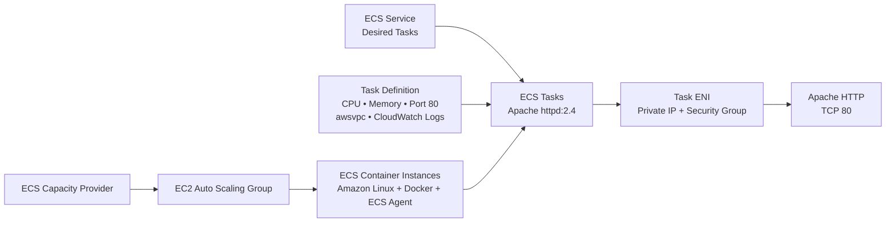

ECS managed the **workload layer**: which task definition to run and how many task copies should exist. The Auto Scaling Group supplied the **compute layer**: the EC2 container instances on which ECS could place those tasks.

### Lab Environment

AWS re/Start provided the sandbox environment and prerequisite resources used by the exercise.

My work focused on creating and configuring the ECS cluster, EC2-backed capacity, task definition, and service; inspecting the underlying container runtime; troubleshooting task-level network connectivity; validating the running application; and observing how ECS workload demand and deployments interacted with the underlying Auto Scaling Group capacity.

## EC2-Backed ECS Capacity

The cluster used an ECS capacity provider connected to an EC2 Auto Scaling Group. The EC2 instances registered with ECS as container instances and supplied the CPU and memory available for task placement.

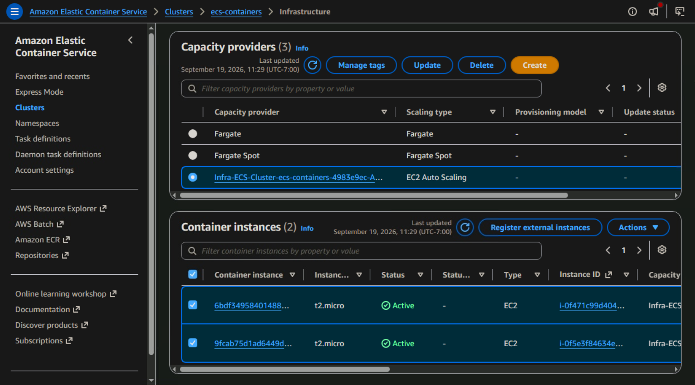

This made the compute model explicit: ECS was the orchestrator, but the application still depended on EC2 hosts that had to exist underneath it.

## Task Definition and Container Runtime

The task definition described how ECS should run the Apache workload. It referenced the `httpd:2.4` image, exposed TCP port `80`, used `awsvpc` networking, and sent container logs to CloudWatch.

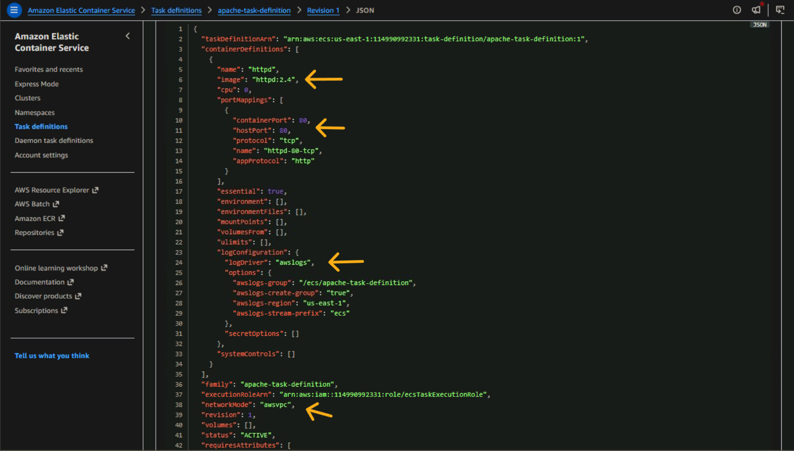

The distinction became useful during the lab: the **container image** described what was packaged, while the **task definition** described how ECS should run that package inside the cluster.

## Scaling the Service and Its Compute Capacity

To make the orchestration relationship easier to observe, I increased the ECS service's desired task count beyond the cluster's original capacity. ECS-managed scaling adjusted the backing Auto Scaling Group rather than treating the existing EC2 hosts as fixed infrastructure.

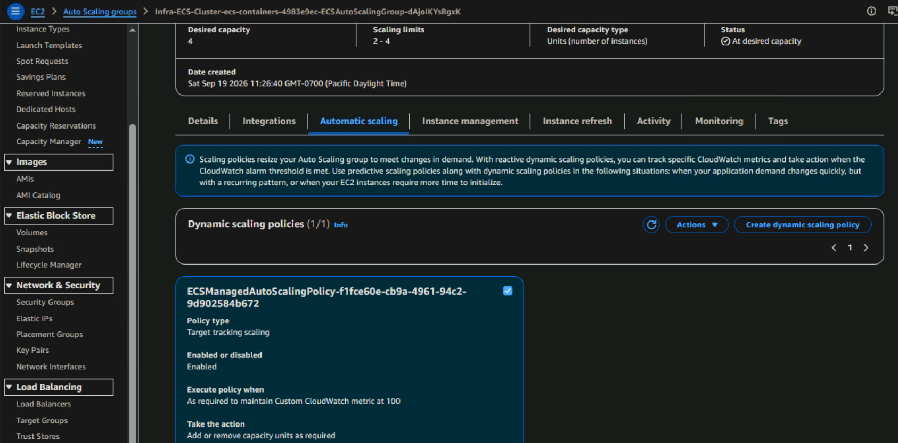

As the service required more task capacity, the Auto Scaling Group expanded until six healthy EC2 instances were available to the cluster.

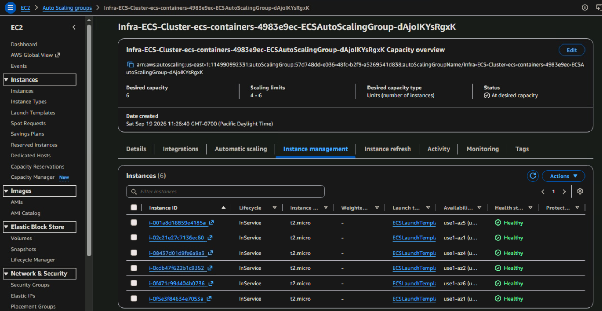

This exposed two separate desired states operating at the same time: the ECS service maintained the desired number of **tasks**, while the Auto Scaling Group maintained the EC2 **host capacity** needed to run them.

## Inspecting the Running Containers

I connected to an ECS container instance and inspected the runtime directly with Docker. `docker ps` showed the Apache workload alongside the ECS agent and pause container, `docker images` confirmed the image available on the host, and `docker logs` showed Apache running normally.

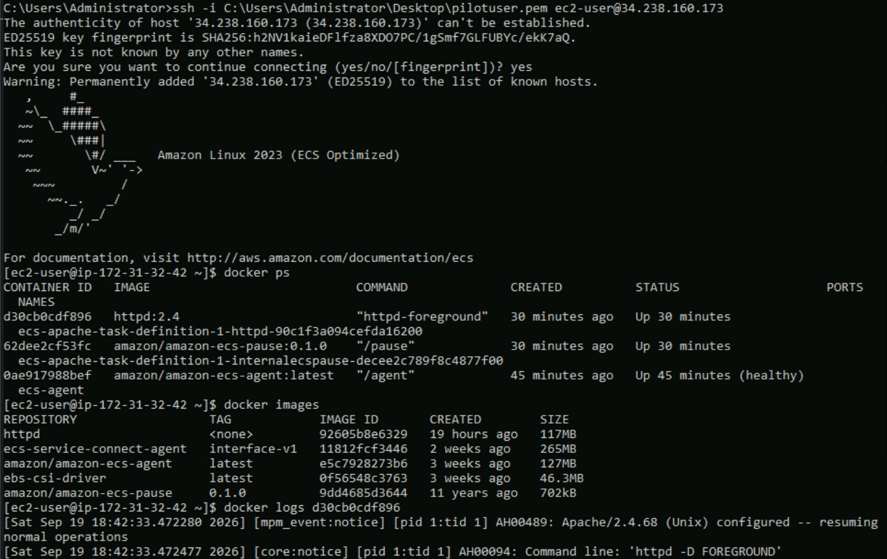

That evidence separated application health from network reachability. Apache was running inside the container even though the initial HTTP checks still failed.

## Troubleshooting Task Reachability

The first test used `curl http://localhost:80` from the EC2 host and returned **connection refused**. Because the task used `awsvpc` networking, the task had its own network interface and private IP; the host's `localhost` referred to the EC2 host itself, not the Apache task.

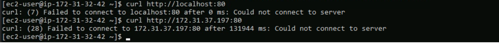

I then curled the task's private IP on port `80`. That request timed out. At that point, the container process and Apache logs already showed a healthy application, so the failure was narrowed to the network path between the EC2 host and the task ENI rather than the application process itself.

I corrected the task-level HTTP access and updated the service networking configuration. That change triggered a rolling deployment rather than replacing every running task at once.

## Rolling Deployment and Capacity Headroom

During the deployment, the existing six tasks remained running while six replacement tasks entered provisioning.

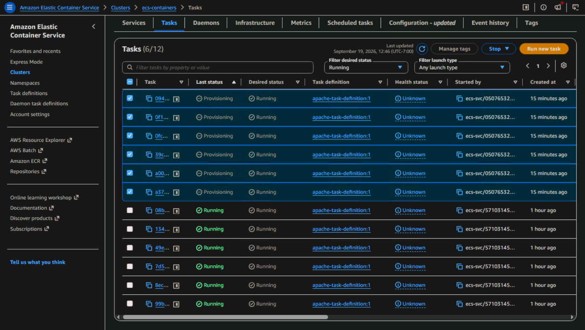

The rollout also exposed a capacity constraint. With the Auto Scaling Group already sized for the six running tasks, replacement tasks needed temporary compute headroom before the old tasks could be stopped. I increased the Auto Scaling Group maximum from `6` to `8` while leaving desired capacity at `6`, allowing ECS-managed capacity room to support the deployment.

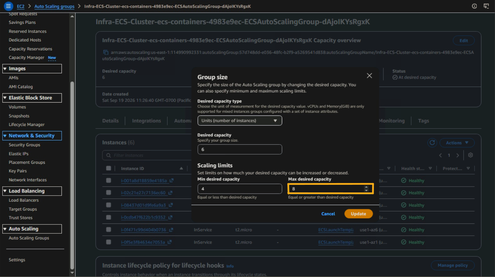

This was a useful distinction between **steady-state capacity** and **deployment capacity**: enough compute to run the current service is not always enough compute to safely replace that service while preserving availability.

## End-to-End Verification

After correcting task reachability and allowing the deployment to complete, I tested the application again using a task private IP.

```bash
curl http://<task-private-ip>:80
```

The request returned the default Apache response:

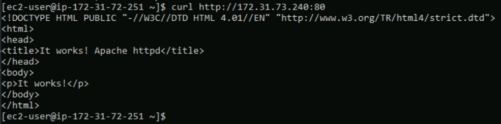

That completed the troubleshooting process by verifying the application through actual runtime behavior. Instead of relying only on ECS showing the task as `RUNNING`, I confirmed that the task was reachable over its private IP on port 80 and that the Apache web server returned the expected response.

## Architecture Tradeoff

This lab used **ECS on EC2**, so ECS managed container orchestration while the EC2 fleet remained an infrastructure layer that still required capacity management. The benefit was direct visibility and control over the hosts and container runtime. The tradeoff was additional operational responsibility compared with a managed container-compute model such as Fargate, where AWS manages the underlying hosts.

## Takeaways

- **Mapping ECS to a Familiar Auto Scaling Pattern**

ECS became much easier for me to understand once I mapped its workload-management components to the EC2 Auto Scaling pattern I was already familiar with.

**Compute layer**

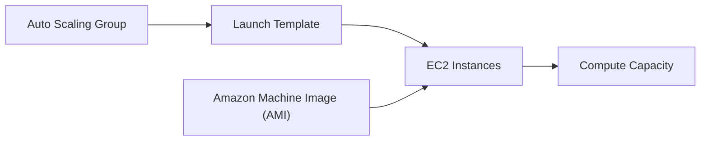

**Workload layer**

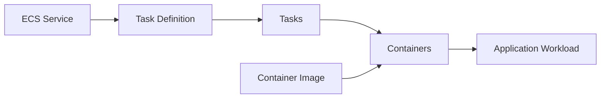

The relationship that made ECS click was:

**Auto Scaling Group → Launch Template → EC2 instances**  
**ECS Service → Task Definition → Tasks → Containers**

An Auto Scaling Group maintains the desired number of EC2 instances and uses a Launch Template when it needs to create them. In the same way an ECS Service maintains the desired number of tasks and uses a Task Definition when it needs to create them.

The AMI provides the machine image used for the EC2 instances, while the container image provides the packaged application used by the containers.

- **Docker runs containers; ECS orchestrates them.** The ECS service maintained task desired state while Docker executed the containers on the EC2 hosts.
- **A running task is not the same as a reachable application.** Runtime state, process health, network interfaces, security groups, and application response all provide different evidence.
- **`awsvpc` changes the networking model.** Each task receives its own ENI and private IP, so the EC2 host's `localhost` is not the task endpoint.
- **Deployments can require temporary headroom.** Capacity sufficient for steady state may be insufficient for a rolling replacement that keeps old tasks running while new ones start.
- **Verification should follow the complete path.** The final `curl` response proved more than a green console status because it validated the application through the task network path itself.
