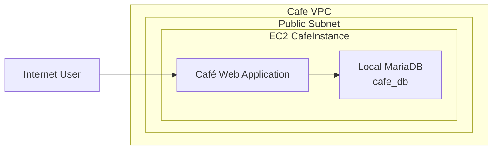
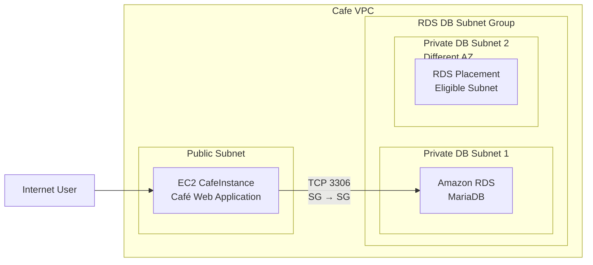
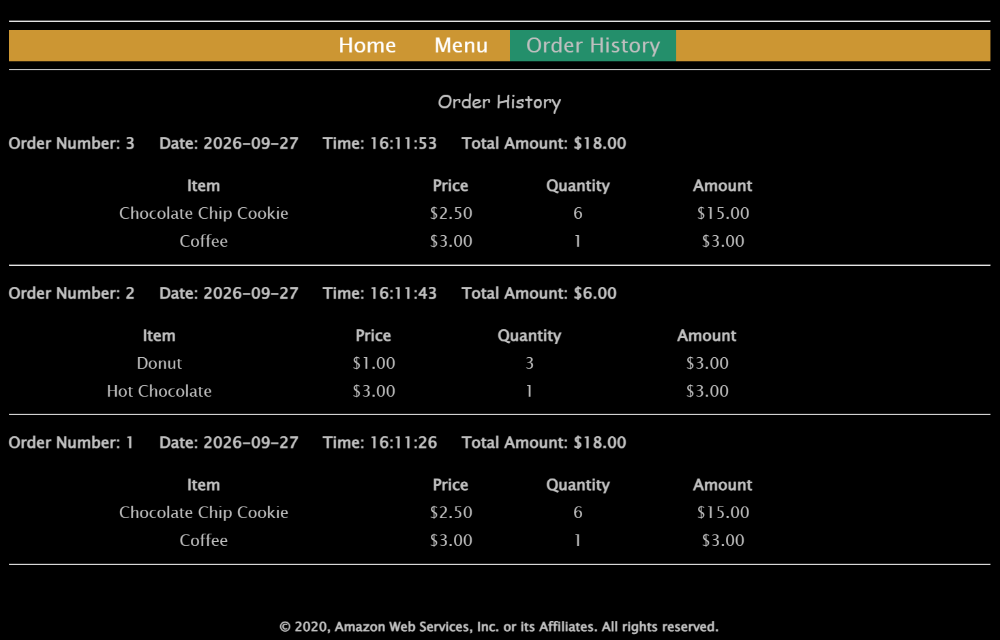
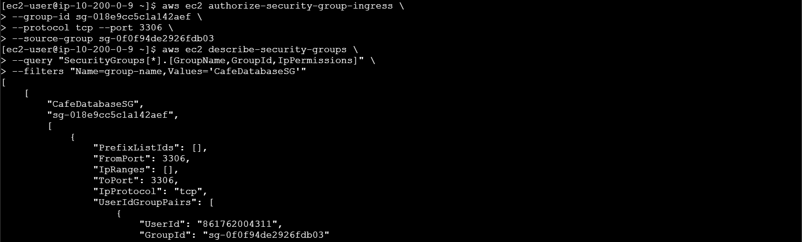
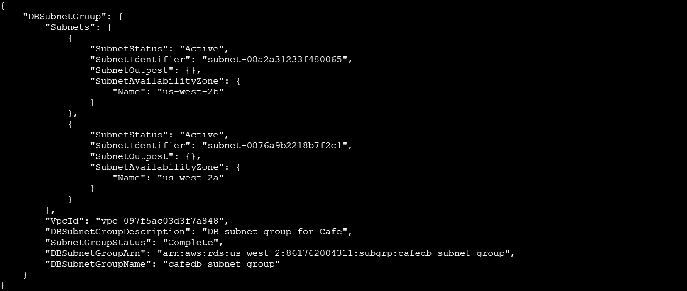
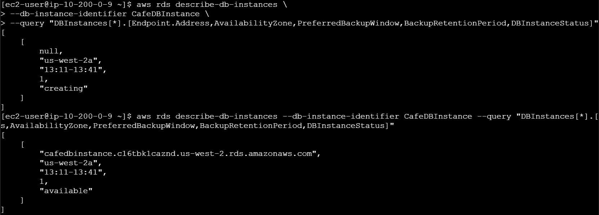
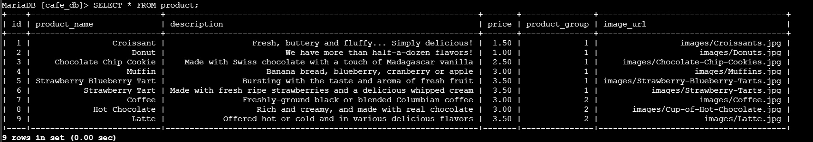
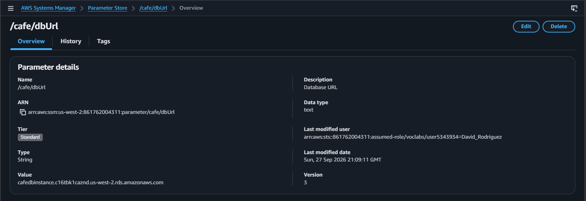
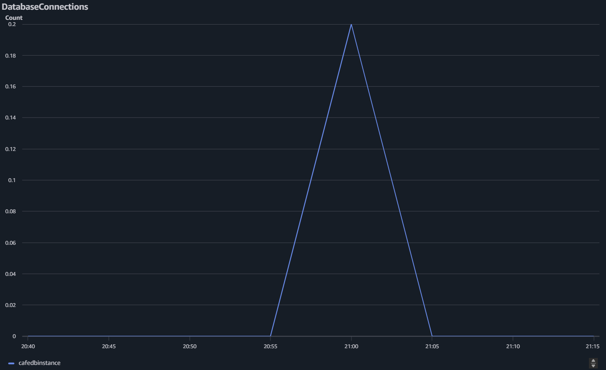

# Migrating an EC2-Hosted Database to Amazon RDS

## Overview

This lab migrated the database for an existing café web application from a MariaDB database running locally on the application EC2 instance to a managed Amazon RDS database.

The migration required more than creating an RDS instance. I built the private database network, restricted access with security groups, provisioned RDS through the AWS CLI, exported and restored the existing application data into the RDS instance, updated the application's database endpoint, and verified both database, and application functionality.

### Architecture

**Before**



**After**



The main architectural change was separating application compute from database state. Instead of running both the application and database on one EC2 instance, the application remained on EC2 while the database moved to Amazon RDS.

### Key Concepts

- **Amazon RDS** — Managed relational database service that separates database operations from the application server.
- **DB subnet group** — Defines the private subnets across Availability Zones where RDS can place database resources.
- **Parameter Store** — Externalizes application configuration so the database endpoint can change without modifying application code.
- **Amazon CloudWatch** — Provides metrics for the RDS instance, including database connection activity.
- **Database migration** — Moves an existing database by exporting its schema and data with `mysqldump` and restoring it in the target database.

### Lab Environment

AWS re/Start provided:

- An EC2 `CafeInstance` running the café web application and its local MariaDB database
- An EC2 `CLI Host` configured for AWS CLI administration
- An existing VPC, public subnet, application security group, and required IAM permissions

The application environment was already running. My work focused on building the private RDS networking and security controls, provisioning the managed database through the AWS CLI, migrating the existing application data, repointing the application to RDS, and validating the completed migration.

## Establishing the Pre-Migration Baseline

Before migrating the database, I generated several orders through the café application and recorded the existing Order History. This created application data that could later be used to verify whether the migration preserved the original database state.




The application and its MariaDB database were still running together on the same EC2 instance at this point.

## Securing RDS Connectivity

I created a dedicated security group for the database and allowed inbound MySQL traffic on TCP port `3306` only from the security group associated with the café application. This securely limited database access to the application rather than exposing the database by a broad IP range or to the public internet.

```text
Cafe EC2 Security Group
          |
          | TCP 3306
          v
CafeDatabaseSG
          |
          v
       Amazon RDS
```

I verified the rule through the AWS CLI.



Using a security-group reference as the source means database access is based on workload membership rather than a hard-coded application IP address. Only instances associated with the approved application security group can initiate database connections through this rule.

## Creating Private Database Networking

I created two private subnets in different Availability Zones and combined them into an RDS DB subnet group. The subnet group gives RDS an approved set of private subnets in which database resources can be placed.



For this lab, the database itself was deployed as a single DB instance rather than a Multi-AZ deployment. A single DB instance keeps the lab simple and inexpensive, but it does not provide Multi-AZ failover. The two-subnet DB subnet group gives RDS the required network foundation while keeping the database private.

## Provisioning Amazon RDS with the AWS CLI

I provisioned the RDS MariaDB instance through the AWS CLI rather than manually creating it through the console.

The instance was configured with:

- MariaDB
- `db.t3.micro`
- 20 GB allocated storage
- Private accessibility
- The dedicated database security group
- The previously created DB subnet group
- Automated backups
- A database endpoint used by the application after migration

I monitored the instance until its state changed to `available` and retrieved its RDS endpoint. The RDS endpoint became the application's new database network destination.



## Migrating the Existing Database

On the café EC2 instance, I exported the existing local `cafe_db` database with `mysqldump`.

```bash
mysqldump \
  --user=root \
  --databases cafe_db \
  --add-drop-database \
  > cafedb-backup.sql
```

The resulting SQL dump contained the statements required to recreate the database schema and restore the existing application data.

I then imported that dump into the new Amazon RDS instance. After restoration, I connected directly to the RDS database and queried the `product` table to verify that the database had been successfully created and populated.

```sql
SELECT * FROM product;
```



This provided direct database-level verification that the migration had succeeded before the application was cut over.

## Repointing the Application to RDS

The café application did not hard-code its database endpoint in the application code. Instead, the database URL was externalized in AWS Systems Manager Parameter Store under `/cafe/dbUrl`. I replaced the original local database address with the endpoint of the new RDS instance.



This allowed the application's database destination to be changed without modifying or redeploying the application code.

Externalizing environment-specific configuration reduces coupling between application code and infrastructure. The application can remain unchanged while its backing database location changes.

## Validating the Cutover

After updating the database endpoint, I reopened the café application and verified that the original Order History was still present. The same orders recorded before the migration remained available after the application had been redirected to RDS.

This validation demonstrated that:

- The original application data was preserved.
- The café application could communicate with the RDS database.
- The application continued functioning after the database was moved off the EC2 instance.

## Monitoring the RDS Database

Amazon RDS publishes operational metrics to CloudWatch. After establishing a database connection from the café EC2 instance, I observed activity in the `DatabaseConnections` metric.



This provided operational verification that connections were reaching the managed database after migration.

Other RDS metrics available for monitoring included:

- CPU utilization
- Free storage space
- Freeable memory
- Read IOPS
- Write IOPS
- Database connections

## Takeaways

This lab **connected several areas:**

- Designing private network placement for a managed database
- Restricting database access with security-group-to-security-group rules
- Provisioning RDS programmatically through the AWS CLI
- Migrating relational data with `mysqldump`
- Working with database endpoints and application configuration
- Separating application compute from persistent database state
- Validating a migration at both the database and application layers
- Monitoring database activity through CloudWatch
- Troubleshooting connectivity across network, transport, and authentication layers
- Reasoning about version compatibility when reproducing older cloud labs

**The main takeaway was that migrating an application database is not just a data-copy operation.**

It requires coordinating infrastructure, networking, security, application configuration, monitoring, as well as data migration.

The successful end state was an unchanged application running on EC2 while its persistent relational data was moved to a privately accessible, managed Amazon RDS database.
