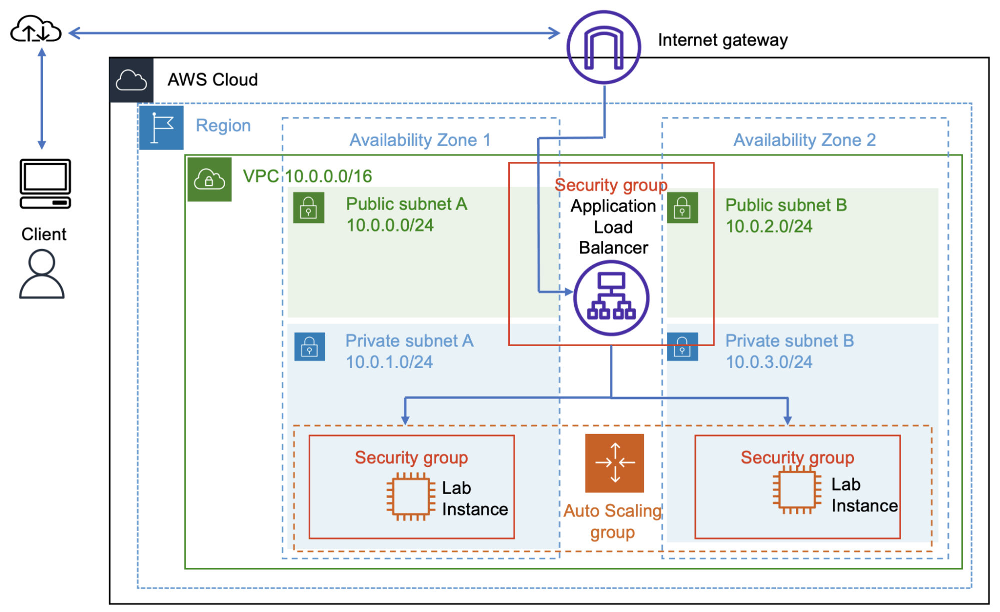
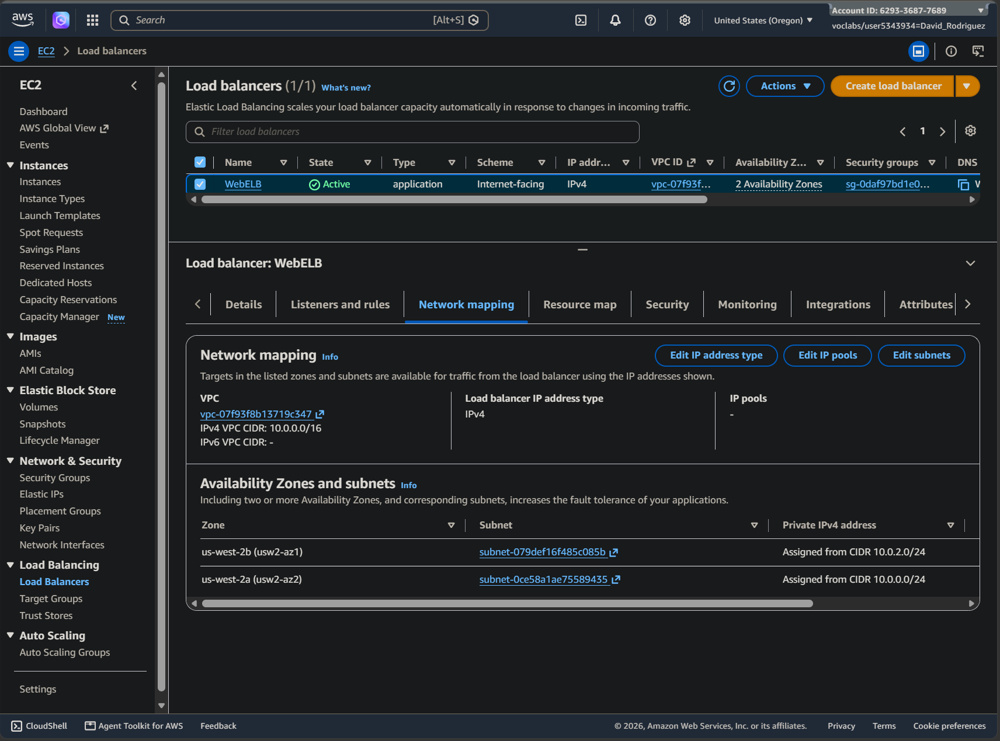
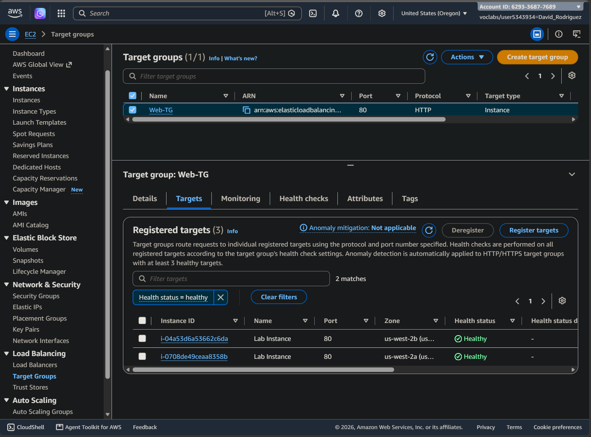
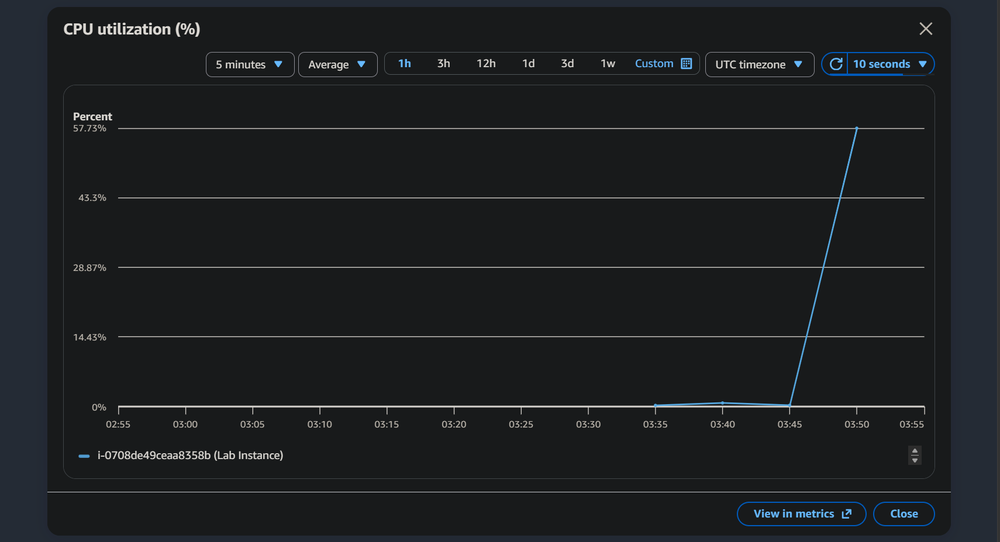
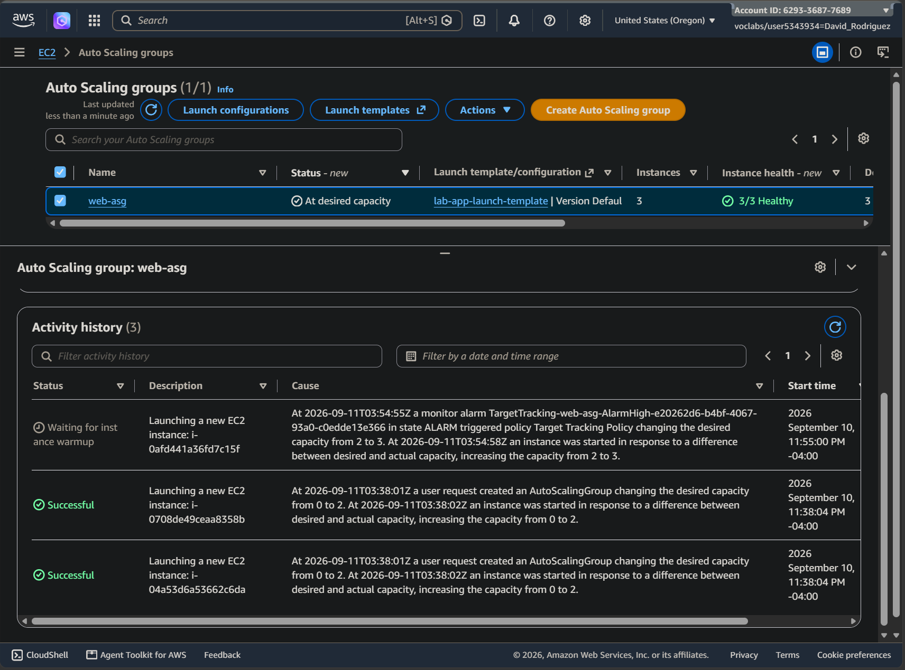
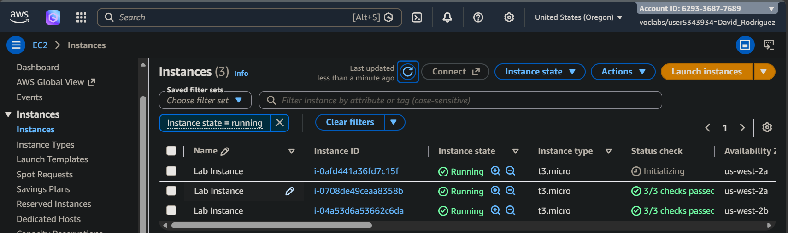
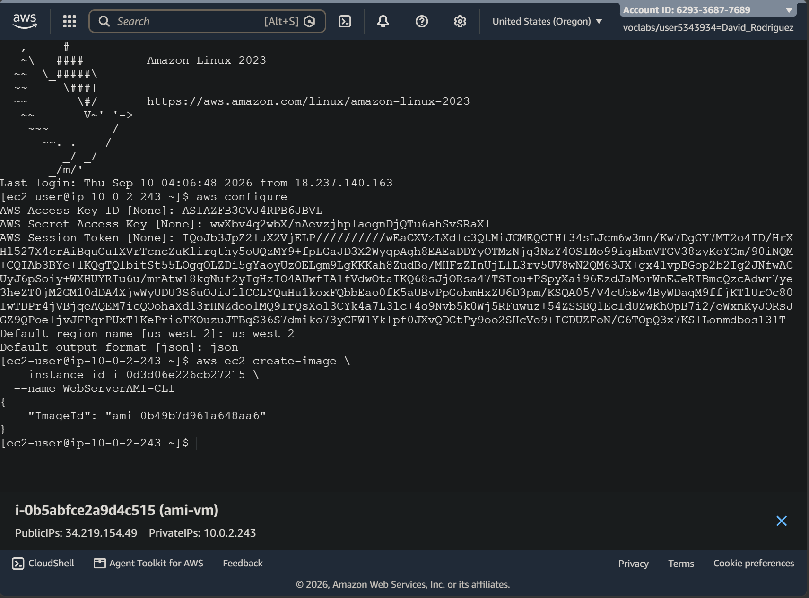

# Scaling and Load Balancing Your Architecture

## Overview

A web application running on a single EC2 instance has fixed capacity and depends on one compute target. As traffic and availability requirements grow, the compute layer needs to become distributed, health-aware, and able to adjust capacity automatically as demand changes.

In this AWS re/Start lab, I transformed a a single-server web workload into a load-balanced, multi-AZ, automatically scaling compute fleet using an Application Load Balancer, health checks, and EC2 Auto Scaling with CloudWatch-driven target tracking.

This web tier needs to survive instance failure and automatically add capacity under load.

The completed architecture placed an internet-facing Application Load Balancer across two public subnets, with Auto Scaling-managed EC2 application instances running in private subnets across two Availability Zones.

The workload moved behind an Application Load Balancer, with private EC2 capacity distributed across two Availability Zones and automatically adjusted by the Auto Scaling group.

## Reproducible Compute

I created an AMI from the original configured web server and used it in a launch template for the Auto Scaling group.

The two resources solve different problems:

**AMI = reproducible machine state**

**Launch template = reproducible instance-launch configuration**

The Auto Scaling group could then use that definition to create additional application instances without rebuilding each server manually.

## Multi-AZ Load Balancing

I created an internet-facing Application Load Balancer across public subnets in two Availability Zones.

The load balancer became the application entry point, separating client access from the identity of any individual EC2 instance, enabling traffic to be distributed across the compute fleet while the application instances themselves remained in private subnets.

## Auto Scaling Compute with Health-Aware Traffic Routing

The Auto Scaling group was configured with:

- Desired capacity: `2`
- Minimum capacity: `2`
- Maximum capacity: `4`
- ELB health checks
- Target tracking at `50%` average CPU utilization

The important management boundary was the **fleet**, not an individual server.

The target group used health checks to determine which instances were ready to receive requests. This connects availability directly to traffic routing: an instance is not useful to the application merely because it exists—it must also be healthy enough to serve traffic.

The Auto Scaling group registered its application instances with the load balancer's target group. The group maintained its required capacity, while the target-tracking policy allowed that capacity to change as workload demand changed.

## Observing Increased Compute Load

CloudWatch metrics provided the signal used by the scaling system to determine when additional capacity was needed.

To test elasticity, I generated sustained application load and monitored the resulting CPU utilization in CloudWatch. The CPU metric rose sharply from near-idle utilization, confirming that the test workload was placing real demand on the compute layer. 

## Verified Scale-Out

As CPU demand increased, the target-tracking alarm triggered the Auto Scaling policy. The Auto Scaling activity history showed the policy changing desired capacity from `2` to `3` and launching another EC2 instance.

This demonstrated the scaling feedback loop: **workload demand → CloudWatch metric → scaling policy → increased desired capacity → additional compute**

The newly launched instance then appeared alongside the existing application servers.

The system had moved from maintaining two baseline instances to automatically adding capacity in response to demand.

## What the Architecture Demonstrated

The lab connected several separate mechanisms into one elastic system:

**AMI + launch template**  
provide reproducible compute

**Auto Scaling group**  
maintains and adjusts fleet capacity

**Application Load Balancer**  
provides a stable entry point and distributes requests

**Target group + health checks**  
route traffic only to healthy compute

**CloudWatch + target tracking**  
allow capacity to respond automatically to demand

The result is an application tier that no longer depends on one EC2 instance or one fixed amount of compute capacity.

## Takeaways

- **The fleet is the system.** Individual EC2 instances are replaceable members of a managed compute tier, while the ALB provides a stable entry point across healthy targets.

- **Load balancing, health checks, and Auto Scaling have distinct roles.** The ALB distributes traffic, health checks determine which instances can receive it, and the ASG maintains and adjusts compute capacity.

- **Elasticity is a feedback loop.** CloudWatch metrics inform the scaling policy, which can increase desired capacity as demand rises; this is different from simply replacing lost capacity to preserve the existing fleet size.

---
---
---

## Optional Lab CLI Challenge

As an optional extension, I created an AMI using the AWS CLI rather than the EC2 console.

The prescribed connection path to the private Auto Scaling instance was not available in the lab environment. Instead, I created and used another EC2 instance with AWS CLI access and referenced the target instance ID directly when creating the image.

This reinforced that AMI creation is an AWS API operation and does not require running the command from the instance being imaged.

