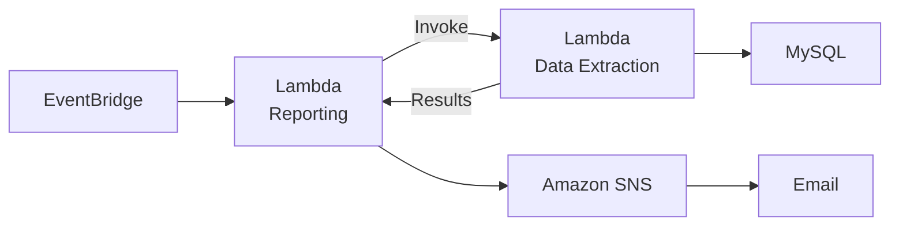
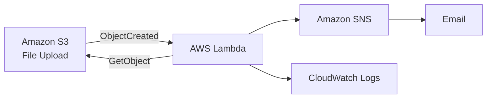

# Serverless & Containerized Workloads

## Labs

### [01 — Serverless Reporting Workflow](serverless-reporting-workflow.md)

Built and troubleshot an event-driven reporting workflow using AWS Lambda, EventBridge, Parameter Store, Amazon SNS, IAM, CloudWatch, and VPC networking. The workflow retrieves sales data from a MySQL database, generates a scheduled report, and delivers the result through SNS.

### [02 — Event-Driven File Processing](event-driven-file-processing.md)

Built and troubleshot an event-driven file-processing workflow using Amazon S3, AWS Lambda, Amazon SNS, CloudWatch, and Python. S3 object creation automatically triggered Lambda to retrieve uploaded text files, calculate word counts, and deliver the result through SNS, with CloudWatch used to diagnose and correct configuration failures.

