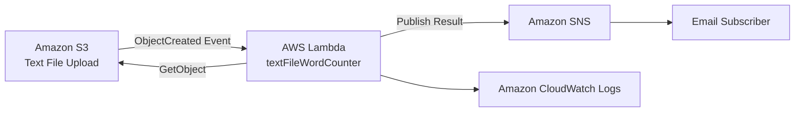
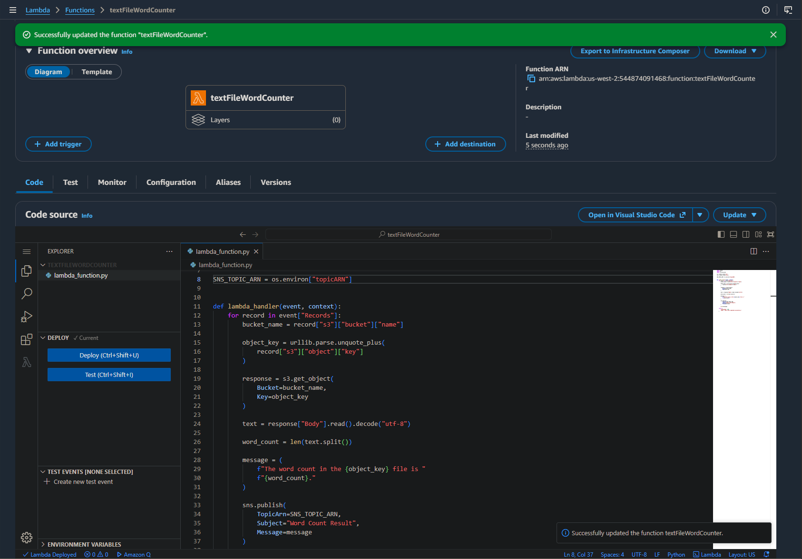
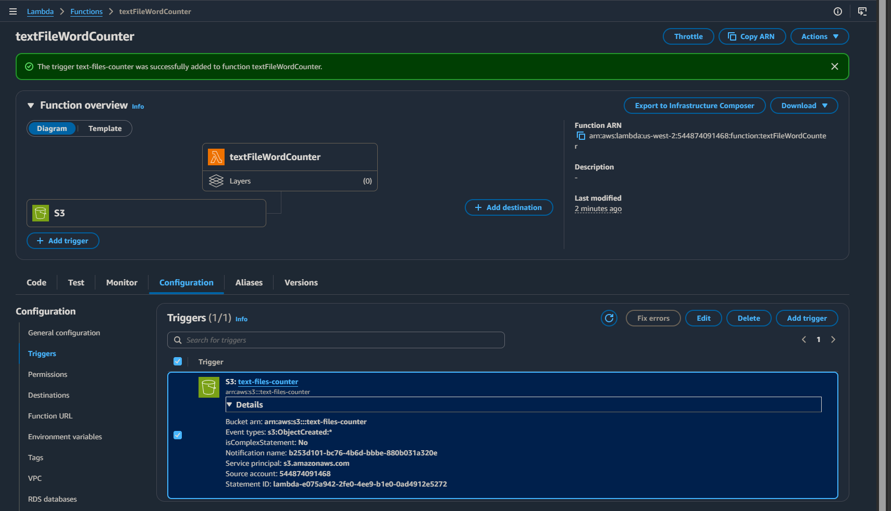
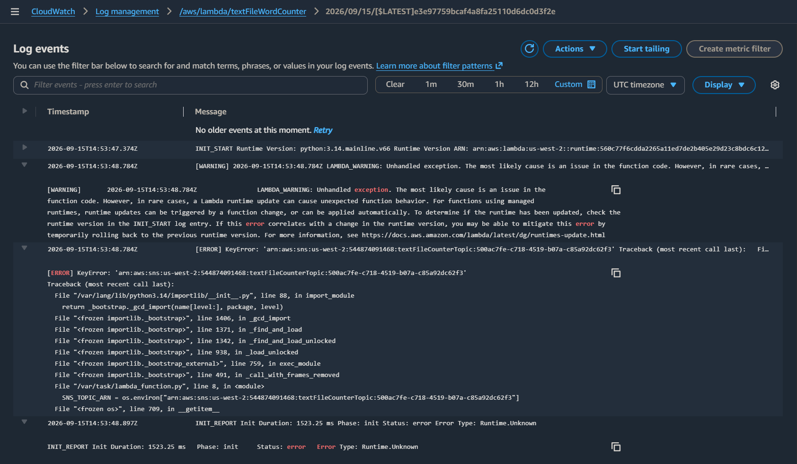
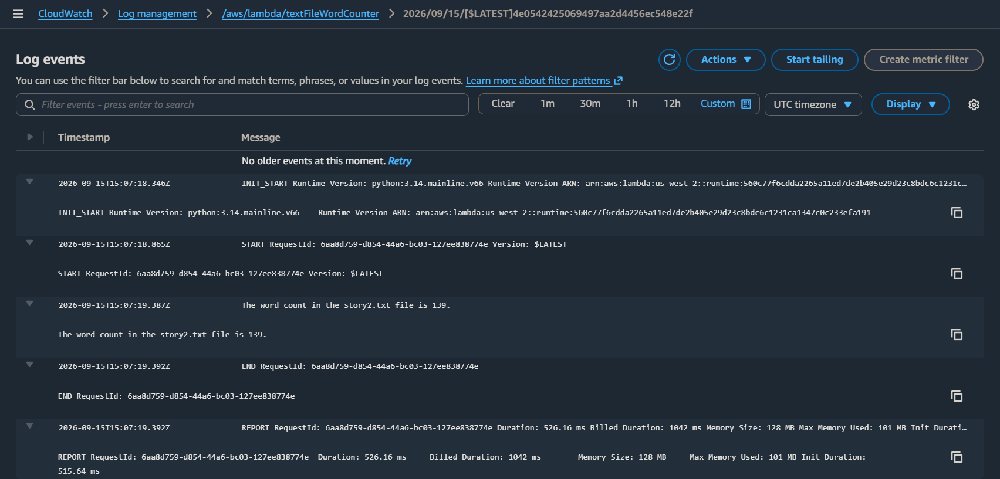
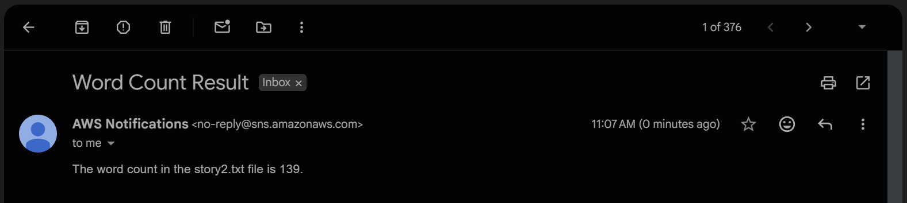
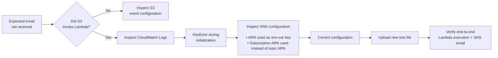

# Event-Driven File Processing

## Overview

When work only needs to happen after a new file arrives, continuously running compute is unnecessary. An event-driven serverless workflow can react to the file creation event, perform the required processing, and stop consuming application compute once the work is complete.

In this AWS re/Start challenge lab, I built a Python AWS Lambda function that automatically processes text files uploaded to Amazon S3. The function retrieves the uploaded object, counts the words in the file, publishes the result to Amazon SNS, and delivers the result through email.

The completed workflow was:

**S3 object creation → Lambda execution → file retrieval → word count → SNS → email**

Unlike the preceding guided Lambda lab, this challenge defined the required behavior but left the implementation open.

AI accelerated the implementation and troubleshooting loop. I used generative AI to translate workload requirements into Python logic, reason through the AWS service integrations, and investigate failures using evidence from CloudWatch, while AWS runtime behavior and end-to-end testing guided validation and final decisions.

I configured the AWS resources, deployed the function, triggered the workflow with real S3 uploads, inspected runtime behavior, traced failures through logs, corrected the configuration, and verified the resulting system end to end.

This extended the engineering pattern I practiced while completing the **AWS Cloud Quest: Generative AI Practitioner** credential, applying the same AI-assisted implementation and troubleshooting approach to an event-driven serverless workflow.

The application uses a simple event-driven flow:



S3 stores the input files and produces the event. Lambda performs the application logic, SNS handles notification delivery, and CloudWatch provides the execution evidence needed to verify and troubleshoot the workflow.

### Lab Environment

AWS re/Start provided the sandbox environment and pre-provisioned `LambdaAccessRole` used by the Lambda function.

Unlike the preceding guided Lambda workflow, the application resources were not already assembled. My work included creating and configuring the Lambda function, S3 bucket and event trigger, SNS topic and subscription, application configuration, testing, and troubleshooting the workflow through successful end-to-end execution.

## Lambda Implementation

I created the `textFileWordCounter` Lambda function using Python. The function receives an S3 event, extracts the bucket name and object key, retrieves the uploaded object through the S3 API, decodes the text contents, calculates the word count, and publishes the result to SNS.

The SNS topic ARN is supplied through an environment variable rather than being embedded directly in the application logic.



[View the full Lambda implementation](text_file_word_counter.py)

## Event-Driven S3 Trigger

I configured the S3 bucket to invoke the Lambda function when an object is created.



Uploading a file to the bucket generated an S3 event containing the bucket and object information Lambda needed to locate and process the file. The function therefore did not need to continuously poll S3 for new files; compute was invoked when the event occurred.

## Troubleshooting the Failed Invocation

After configuring the S3 trigger, I uploaded a text file to test the workflow, but the expected SNS email did not arrive. Rather than changing multiple parts of the system immediately, I traced the workflow from the event source forward. CloudWatch showed that Lambda had been invoked, confirming that the file upload and the **S3 → Lambda** event relationship were working and narrowing the problem away from the trigger configuration.

I then opened the corresponding CloudWatch log stream and inspected the traceback. The function had failed with a Python `KeyError` during initialization, shifting the investigation toward the Lambda configuration.



The traceback pointed to the environment-variable lookup:

```python
SNS_TOPIC_ARN = os.environ["arn:aws:sns:..."]
```

The value inside the `KeyError` was itself an SNS ARN. That showed that Lambda was attempting to find an environment variable whose name was the ARN itself. Inspecting the code and SNS configuration exposed two separate mistakes.

### Misconfiguration 1: Using the ARN as the Environment-Variable Key

I had incorrectly placed the full SNS ARN inside `os.environ[...]`:

```python
SNS_TOPIC_ARN = os.environ[
    "arn:aws:sns:us-west-2:<account-id>:textFileCounterTopic:<subscription-uuid>"
]
```

`os.environ[...]` expects the **name of an environment variable**, not the value stored inside it. Lambda was therefore looking for an environment variable literally named after the ARN, which did not exist and caused the `KeyError`.

I corrected the lookup to use the actual environment-variable key:

```python
SNS_TOPIC_ARN = os.environ["topicARN"]
```

The Lambda environment configuration then used:

```text
Key:   topicARN
Value: <SNS topic ARN>
```

### Misconfiguration 2: Using the SNS Subscription ARN Instead of the Topic ARN

The ARN value itself also referenced the wrong SNS resource. I had copied the **subscription ARN**, which contained an additional UUID identifying the individual email subscription:

```text
arn:aws:sns:us-west-2:<account-id>:textFileCounterTopic:<subscription-uuid>
```

The Lambda function needed to publish to the **SNS topic**:

```text
arn:aws:sns:us-west-2:<account-id>:textFileCounterTopic
```

I replaced the subscription ARN with the topic ARN as the value of `topicARN`.

***The code treated the ARN value as though it were the environment-variable key, and the ARN value itself pointed to the subscription rather than the topic.***

## Verification After the Fix

After correcting both configuration problems, I tested the original workflow again by uploading another text file to S3. CloudWatch showed a successful execution:

```text
START
The word count in the story2.txt file is 139.
END
REPORT
```



The SNS email then arrived with the same result:



Together, the CloudWatch execution and SNS delivery verified the complete workflow through actual behavior.

## Troubleshooting Approach

The visible symptom was that the expected email never arrived, but the failure could have existed at several points in the workflow. I narrowed the problem by checking the service boundaries in sequence rather than treating the application as one black box.



Confirming that Lambda had been invoked ruled out the S3 trigger as the primary problem. The CloudWatch traceback then narrowed the failure to the environment-variable lookup, and inspecting that configuration exposed both errors. After correcting them, I repeated the original event and verified the workflow end to end.

## Takeaways

- **Event-driven systems can react directly to changes in application state.** S3 object creation triggered processing without requiring a continuously running process to watch for new files.

- **Events carry the context required for downstream work.** The S3 event supplied the bucket and object information Lambda needed to retrieve and process the uploaded file.

- **Successful triggering does not guarantee successful processing.** S3 correctly invoked Lambda even while invalid application configuration prevented the function from completing, and CloudWatch provided the evidence needed to isolate the failure.

- **Configuration details matter across service boundaries.** Environment-variable keys and values serve different purposes, and SNS topic ARNs and subscription ARNs identify different resources.
