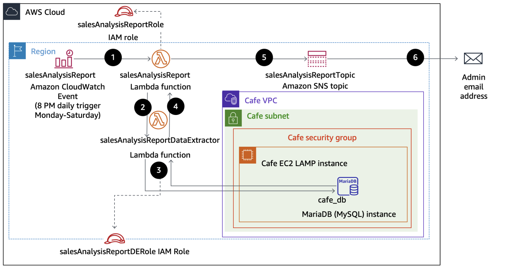
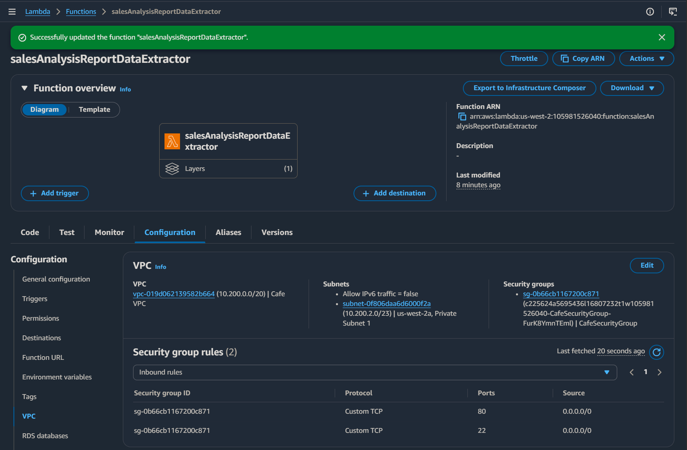
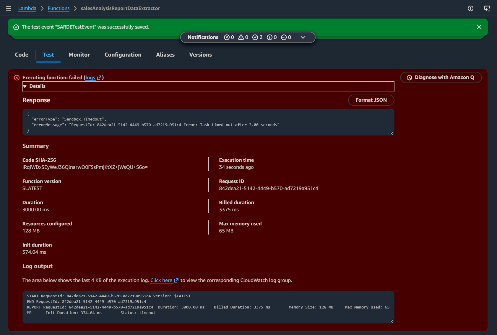
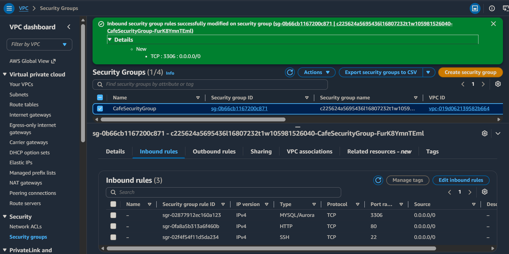
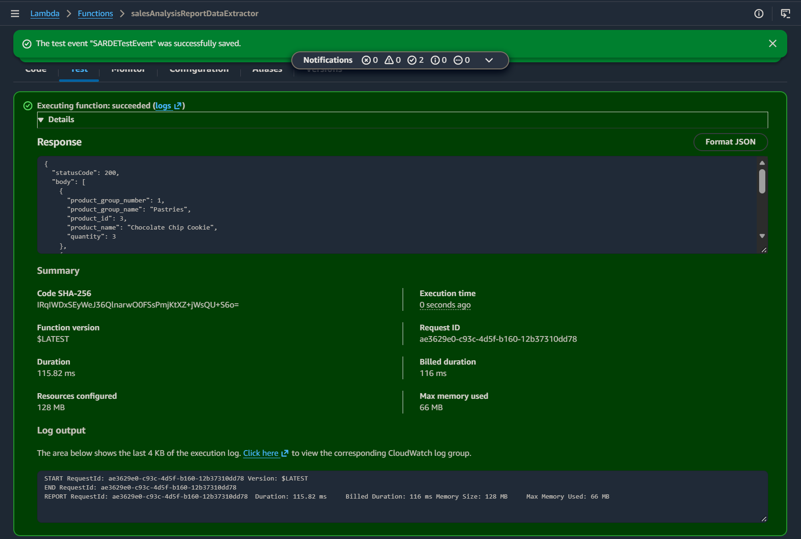
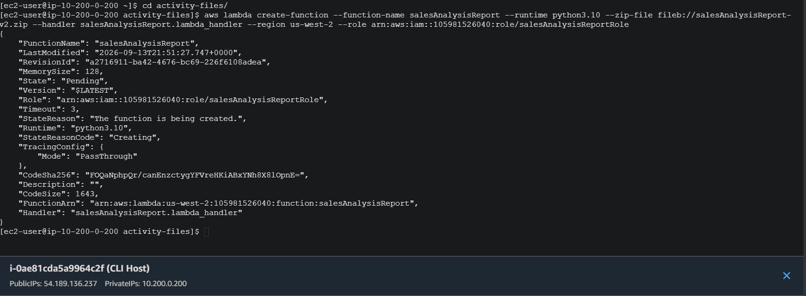
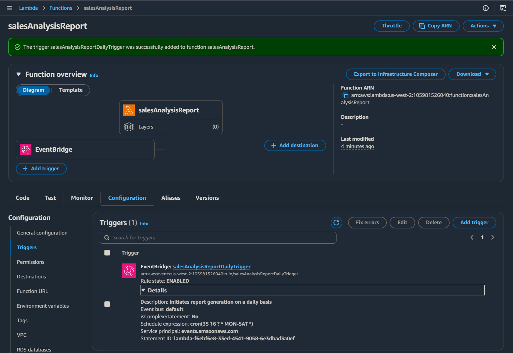
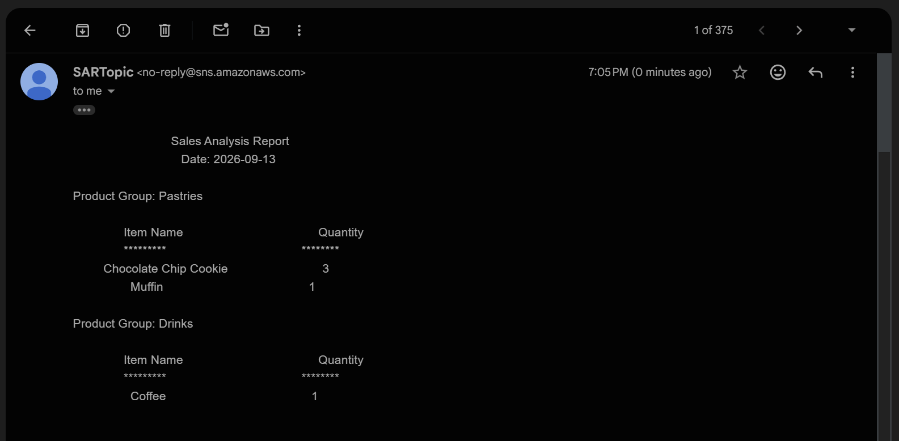

# Serverless Reporting Workflow

## Overview

For a workload that runs briefly on a schedule, continuously running application compute creates unnecessary idle infrastructure and operational overhead. An event-driven serverless architecture allows compute to run only when triggered, perform the required work, and then relinquish the underlying capacity until the next event.

In this AWS re/Start lab, I assembled a serverless reporting workflow using AWS Lambda, VPC networking, Parameter Store, Amazon SNS, EventBridge, IAM, and CloudWatch. The workflow extracted café sales data from a database, generated a sales report, delivered it through SNS, and automated recurring execution through a scheduled event.

*Lab-provided target architecture.*

The architecture separated workflow orchestration from database access. The `salesAnalysisReport` Lambda function coordinated configuration, data retrieval, report generation, and delivery, while `salesAnalysisReportDataExtractor` handled database access. Managed AWS services provided scheduling, configuration, notifications, permissions, networking, and logging around those functions.

### Lab Environment

The AWS re/Start lab environment provided the existing café application, MySQL database running on an EC2 LAMP instance, IAM roles, database connection parameters, CLI host, and Lambda source packages used by the workflow.

My work focused on deploying and configuring the Lambda functions, attaching dependencies, integrating the functions with the existing VPC and database, configuring notifications and scheduled execution, testing the workflow, and troubleshooting failures across the service boundaries.

## Data Extraction and VPC Integration

The `salesAnalysisReportDataExtractor` Lambda function was responsible for querying the café database rather than operating as an isolated function.

I attached the provided `pymysqlLibrary` Lambda layer, which supplied the external PyMySQL client dependency required for the function to communicate with MySQL. I then configured the extractor for access to the café VPC, subnet, and security group.

This demonstrated an important serverless boundary: AWS manages the function's underlying compute, but the function must still have the correct network path and security configuration to reach private dependencies.

The separation also kept database-specific requirements isolated to the extractor. The extractor carried the MySQL dependency and VPC access, while the reporting function handled configuration, orchestration, and notification. At this stage, the function was connected to the required VPC resources, but the security group had not yet been configured to permit MySQL traffic. Testing exposed that gap.

## Troubleshooting Database Connectivity

The first database-connected invocation failed with a timeout.

The function was executing, but it could not successfully reach the database. Tracing the failure to the network path showed that MySQL traffic on TCP port `3306` was not permitted by the relevant security-group configuration.

I added the required MySQL rule to allow the Lambda-to-database connection.

After correcting the network access and retesting the function, the extractor successfully returned actual product and quantity data from the database.

The troubleshooting sequence made the service boundary clear by showing that successful Lambda execution still depends on VPC connectivity, security-group access, and a reachable database. A function can run successfully at the Lambda runtime level while still failing because a downstream dependency is unreachable.

## Creating and Orchestrating the Reporting Function

I created the primary `salesAnalysisReport` Lambda function programmatically using the AWS CLI rather than only through the console.

The reporting function acted as the workflow orchestrator. It retrieved database connection configuration from Parameter Store, passed that configuration to the extractor Lambda, received the query results, formatted the report, and published the finished message to Amazon SNS.

This introduced two layers of **decoupling**: changeable database configuration was kept outside the function code, and workflow orchestration was separated from database access.

Creating the function through the CLI also reinforced that Lambda resources and configuration can be managed through AWS APIs rather than requiring manual console workflows.

## Scheduled Event-Driven Execution

I configured an EventBridge scheduled trigger for the reporting function.

The reporting process could now execute automatically based on an event rather than requiring a manual run.

During scheduled testing, the workflow initially did not run because the EventBridge rule was configured for Monday through Saturday while the test was being performed on Sunday. I adjusted the schedule to include Sunday so the workflow could be validated immediately.

After the schedule was corrected, EventBridge successfully triggered the reporting function, but CloudWatch Logs showed that the function was reaching its configured execution timeout before completing the workflow. Increasing the Lambda timeout allowed the downstream extraction and notification process to finish.

When the corrected scheduled execution ran, the workflow retrieved the sales data, generated the report, published it through SNS, and delivered the resulting report by email.

This verified the complete workflow through its actual output rather than only through resource configuration.

## Takeaways

- **Serverless systems are service integrations, not isolated functions.** Lambda worked together with networking, configuration, scheduling, messaging, IAM, logging, and the database to form the application workflow.

- **Event-driven execution separates workload logic from when it runs.** EventBridge triggered the reporting function on schedule, while Lambda provided compute only when the workflow executed.

- **Configuration should be separated from application logic.** Database connection information was externalized in Parameter Store rather than embedded directly in the function code, allowing configuration to change without modifying the application itself.

- **Serverless does not remove network architecture.** A Lambda function accessing a VPC resource still depends on a valid network path and security controls.
