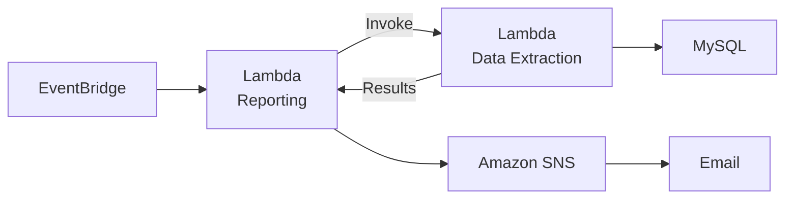
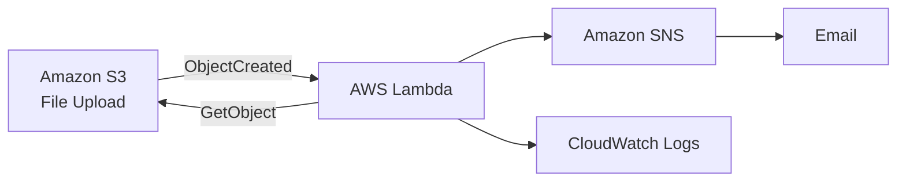

# Serverless and Event-Driven Architecture

## About

Many application tasks do not need a continuously running server. Reports may need to run on a schedule, files may need processing only when they arrive, and other workflows may need compute only when a specific event occurs. Event-driven serverless architecture lets those events trigger ***application logic on demand while managed services handle much of the underlying compute infrastructure.***

This model is useful for automating intermittent or asynchronous work without maintaining always-on application servers. It can reduce idle infrastructure and operational overhead while making it easier to connect event sources into loosely coupled workflows. The ***tradeoff is that failures can span multiple managed-service boundaries***, so permissions, configuration, networking, retries, and logs become important parts of operating the system.

The [Serverless Reporting Workflow](serverless-reporting-workflow.md) uses a **scheduled event** to initiate a multi-service Lambda workflow that retrieves data, generates a report, and delivers the result through SNS.

The [Event-Driven File Processing](event-driven-file-processing.md) lab uses a **state-change event** instead: an S3 object upload automatically invokes Lambda to process the new file and publish the result.

Together, they apply the same event-driven serverless pattern across both **time-driven** and **state-change-driven** triggers, requiring the same broader capability: integrating, troubleshooting, and validating event-driven workflows across AWS services.

## Labs

### [01 — Serverless Reporting Workflow](serverless-reporting-workflow.md)

Built and troubleshot an event-driven reporting workflow using AWS Lambda, EventBridge, Parameter Store, Amazon SNS, IAM, CloudWatch, and VPC networking. The workflow retrieves sales data from a MySQL database, generates a scheduled report, and delivers the result through SNS.

### [02 — Event-Driven File Processing](event-driven-file-processing.md)

Built and troubleshot an event-driven file-processing workflow using Amazon S3, AWS Lambda, Amazon SNS, CloudWatch, and Python. S3 object creation automatically triggered Lambda to retrieve uploaded text files, calculate word counts, and deliver the result through SNS, with CloudWatch used to diagnose and correct configuration failures.

