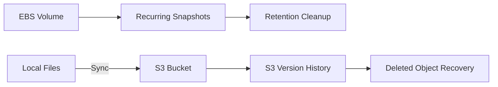

# Storage & Recovery

## About

More than provisioning capacity, cloud storage is about making persistent data usable by the operating system, protecting it against loss, managing it over time, and recovering it when files or volumes are deleted or changed.

Storage and recovery spans both **block storage** and **object storage**, with different mechanisms for making data usable, protecting it, and restoring it when needed. Amazon EBS provides persistent block storage that Linux exposes as a block device, which must be formatted with a filesystem and mounted before applications or users can store files on it. Recovery extends that lifecycle by preserving volume state through snapshots and restoring that state as new storage.

The same protection problem appears differently with Amazon S3. Instead of restoring an entire block volume, **S3 Versioning** preserves historical object states so individual deleted or overwritten objects can be recovered. Automation helps manage storage, but snapshots still need retention rules and synchronized deletions still need a recovery method.

[EBS Block Storage & Snapshot Recovery](amazon-ebs.md) focuses on the **Linux storage path and volume-level recovery**: attaching EBS storage, creating a filesystem, mounting it, persisting the mount configuration, snapshotting the volume, and restoring the original data from that snapshot.

[AWS Storage Lifecycle & Recovery](managing-storage.md) extends that foundation into **storage lifecycle management**: automating EBS snapshot creation and retention, synchronizing local files to S3, propagating deletion state, and recovering a deleted object from S3 version history.

Together, the labs demonstrate the broader capability of making persistent storage usable, protecting stored state, managing backup lifecycle, and verifying recovery across both block and object storage.

## Labs

### [01 — EBS Block Storage & Snapshot Recovery](amazon-ebs.md)

Configured an Amazon EBS data volume for Linux by formatting the attached block device with an `ext3` filesystem, mounting it into the directory tree, and persisting the mount through `/etc/fstab`. A snapshot was then used to create a restored volume, and the original test file was recovered to verify the backup.

### [02 — AWS Storage Lifecycle & Recovery](managing-storage.md)

Managed storage protection through two related workflows: recurring EBS snapshots with retention cleanup, and versioned S3 synchronization with deleted-object recovery. The lab demonstrated that backup operations require lifecycle management and that S3 Versioning can preserve recoverable object history even after deletion is synchronized.

