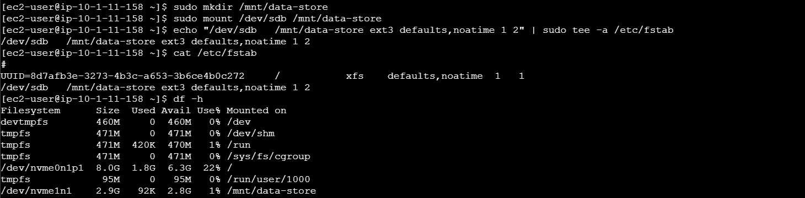
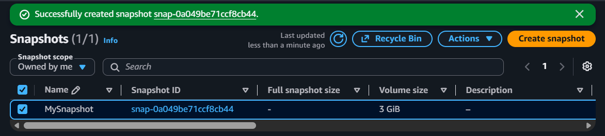
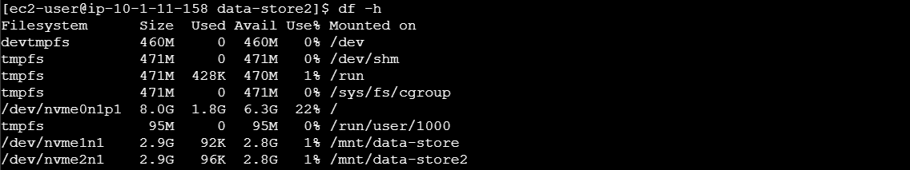
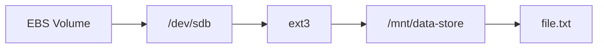

# EBS Block Storage & Snapshot Recovery

## Overview

This lab focused on the Linux storage path behind an Amazon EBS volume: attaching block storage to an EC2 instance, creating a filesystem on the device, mounting it into the Linux directory tree, persisting the mount configuration, and recovering stored data from an EBS snapshot.

### Lab Environment

AWS re/Start provided the EC2 instance and supporting lab environment. My work focused on creating and configuring the EBS data volume, working with the Linux filesystem and mount configuration, creating a snapshot, restoring storage from that snapshot, and verifying that the original data was recoverable.

## Block Device and Filesystem

After attaching the new EBS volume to the EC2 instance, I formatted the device with an `ext3` filesystem.

```bash
sudo mkfs -t ext3 /dev/sdb
```

The important distinction was that the EBS volume provides **block storage**, while the filesystem defines how Linux organizes files and directories on that storage. The device reference identifies the storage device; formatting it creates the filesystem that can then be mounted and used normally.


## Mounting and Persisting the Volume

I created `/mnt/data-store` as the mount point and mounted the filesystem there.

```bash
sudo mkdir /mnt/data-store
sudo mount /dev/sdb /mnt/data-store
```

I then added the volume to `/etc/fstab` so the filesystem could be mounted automatically after a restart.

```text
/dev/sdb /mnt/data-store ext3 defaults,noatime 1 2
```

`df -h` verified that the additional filesystem was mounted at `/mnt/data-store`. On this EC2 instance, the attached EBS device appeared as an NVMe device in the filesystem output.



A test file was written to the mounted volume so that the later recovery process could verify that the snapshot preserved actual data rather than only the storage configuration.

## Snapshot and Recovery

I created an EBS snapshot of the configured data volume. The snapshot captured the volume state so that a new EBS volume could later be created from it.



After creating a new volume from the snapshot and attaching it to the EC2 instance, I mounted the restored filesystem at a second mount point:

```bash
sudo mkdir /mnt/data-store2
sudo mount /dev/sdc /mnt/data-store2
```

Listing the restored filesystem showed the original `file.txt`, confirming that the data stored on the first volume was preserved through the snapshot and recovery process.


Finally, `df -h` showed both the original and restored EBS filesystems mounted at the same time: one at `/mnt/data-store` and the other at `/mnt/data-store2`.



## Verification

The lab verified the full storage lifecycle:

- The EBS volume was formatted with an `ext3` filesystem and mounted for use in Linux.
- The mount was made persistent through `/etc/fstab`, and data was written to the volume.
- An EBS snapshot was created and used to restore the volume as new storage.
- The original test file was successfully recovered from the restored volume.

## Takeaways

- **Mental model for how block storage becomes usable file storage:**
    
**Core model:**

**In this lab:**


- **EBS provides block storage; it does not itself provide the filesystem.**
- A Linux block device, filesystem, and mount point are separate layers with different responsibilities.
- `mkfs` prepares a block device with a filesystem, while `mount` exposes that filesystem at a directory in the Linux tree.
- `/etc/fstab` provides persistent mount configuration rather than requiring the volume to be mounted manually after every restart.
- EBS snapshots provide a recovery mechanism by allowing new volumes to be created from previously captured volume state.
- Verifying recovery means checking the restored data, not merely confirming that a new volume exists.
