# AWS Storage Lifecycle & Recovery

## Overview

This lab focused on managing persistent AWS storage through two related workflows:

1. Automating and retaining Amazon EBS snapshots for an EC2 workload.
2. Synchronizing local files to Amazon S3 and recovering deleted data through S3 Versioning.

The lab moved beyond creating storage resources into basic storage lifecycle operations: **backup creation, retention, synchronization, and recovery.**

### Lab Environment

AWS provided two EC2 instances inside an existing VPC:

- **Command Host** — used to administer AWS resources through the AWS CLI.
- **Processor** — workload instance with an attached EBS volume.

During the lab, I:

- Created an S3 bucket.
- Attached the provided `S3BucketAccess` IAM role to the Processor instance.
- Managed EBS snapshots through the AWS CLI.
- Used scheduled snapshot creation and a Python retention script.
- Enabled S3 Versioning.
- Synchronized files between the Processor instance and S3.
- Recovered a deleted object from a previous S3 version.

## EBS Snapshot Lifecycle Management

### Snapshot Creation

I identified the EBS volume attached to the Processor instance and created an initial snapshot through the AWS CLI.

The lab then used `cron` to repeatedly create snapshots, demonstrating how recurring backups can be automated rather than created manually.

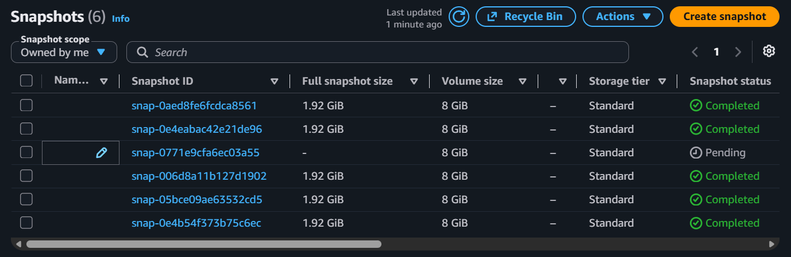

### Snapshot Retention

Repeated snapshots create a second problem: old backups accumulate unless a retention policy removes them.

A provided Python script retrieved the snapshots associated with the EBS volume, sorted them by creation time, and deleted older snapshots while retaining the newest two.

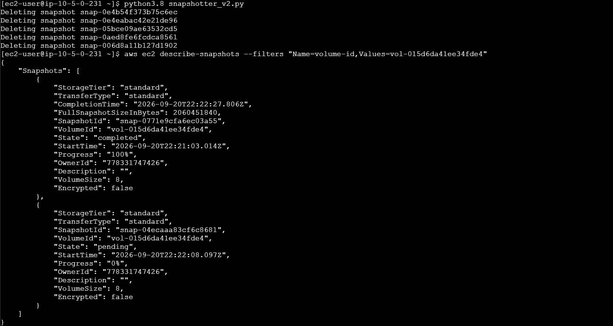

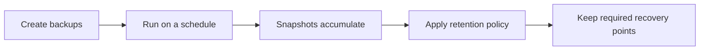

The important concept was not the specific script syntax, but that backup systems need both **creation and retention logic**.

## S3 Synchronization and Version Recovery

### Initial Synchronization

S3 Versioning was enabled before synchronizing three local files into the bucket.

The local directory was then copied to S3 with `aws s3 sync`, and the resulting objects were verified from the CLI.

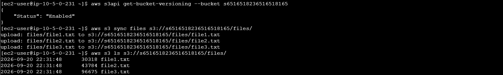

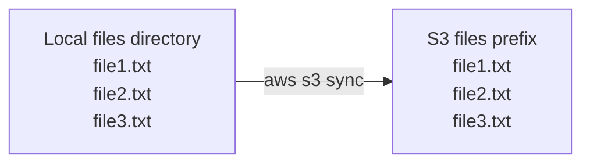

### Synchronizing Deletions

`file1.txt` was removed locally.

The directory was then synchronized again using the `--delete` option:

```bash
aws s3 sync files s3://<bucket-name>/files/ --delete
```

This caused S3 to mirror the local state and remove the corresponding current object from the bucket.

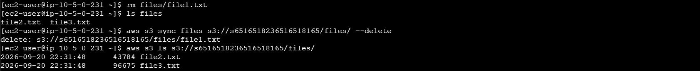

The important distinction was that ordinary synchronization copies changes, while `--delete` can also remove destination objects that no longer exist in the source.

## Recovering a Deleted Object

Because S3 Versioning was enabled, deleting `file1.txt` did not immediately eliminate its previous version.

Inspecting the object's version history showed both:

- the retained object version
- a **delete marker** representing the current deleted state

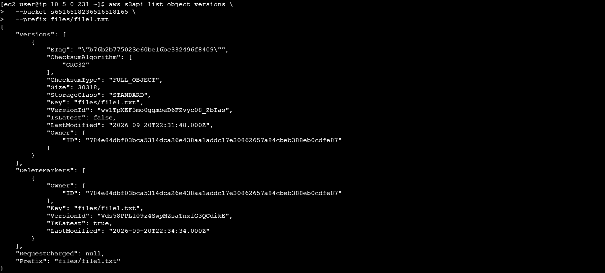

The earlier version was retrieved by specifying its `VersionId`.

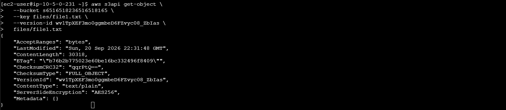

After restoring the file locally and synchronizing the directory again, all three objects were present in S3.

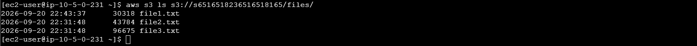

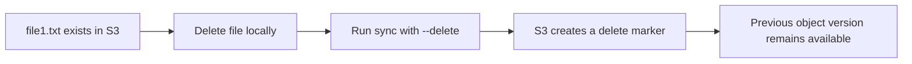
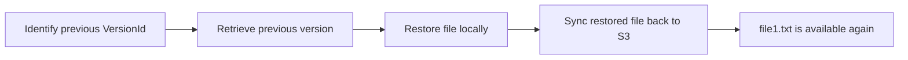

## Takeaways

- Backup automation needs both **creation** and **retention** behavior.
- Synchronization alone should not be confused with backup. Synchronization can support backup, but recoverability requires preserved versions or copies.
- S3 Versioning preserves previous object states and enables recovery after accidental deletion.
- A delete marker hides the current object without immediately destroying its retained historical versions.
